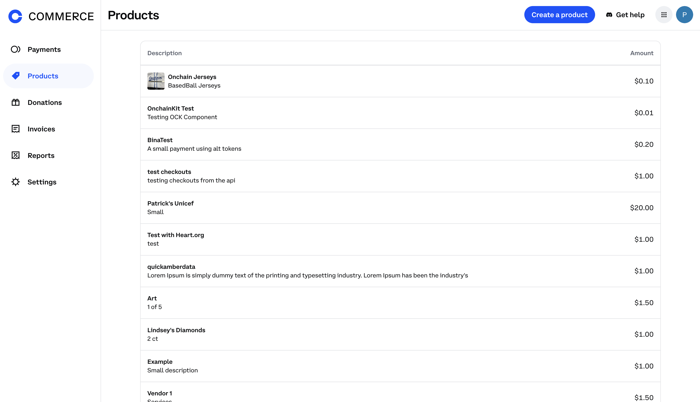
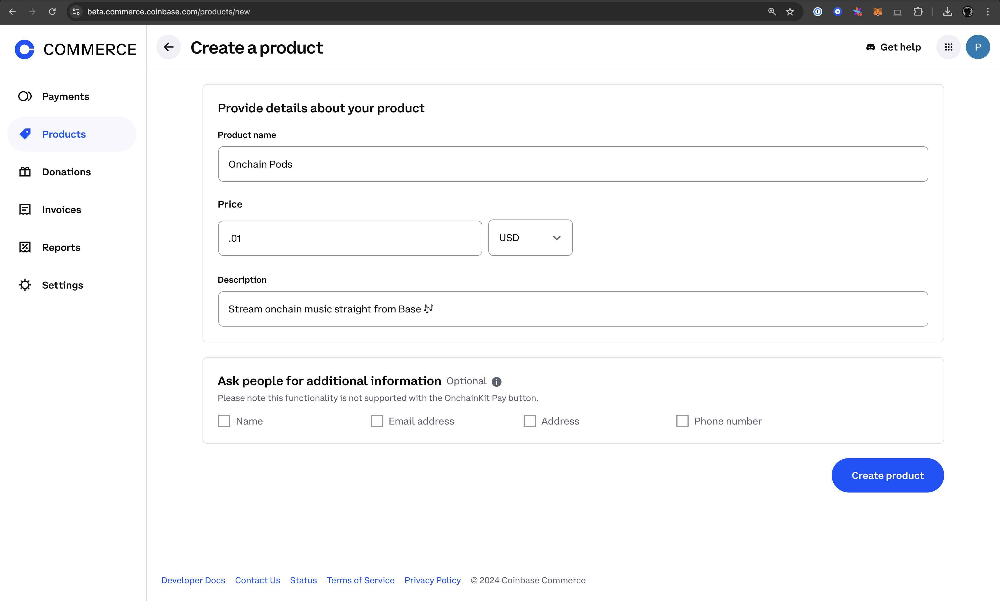
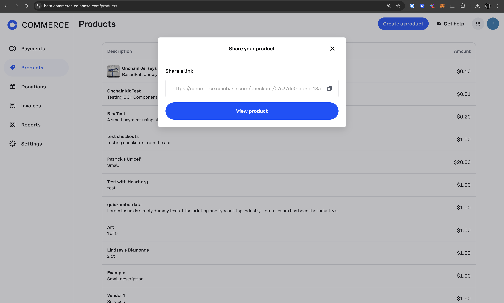
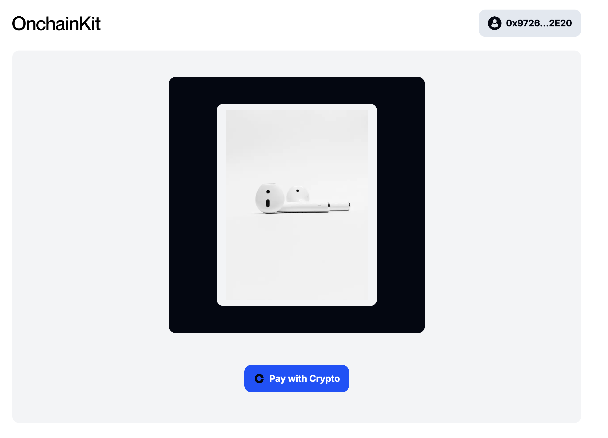

# Build a eCommerce App using Coinbase Commerce and OnchainKit

Looking to sell items and receive crypto on Base? Well, look no further!
This tutorial will guide you through the process of integrating Coinbase Commerce products into your application using OnchainKit. By the end of the tutorial you will be able to spin up a demo store that allows you to sell products for crypto. If you customers do not have crypto wallets, they can easily sign up with a few clicks using [Passkeys].

## Prerequisites

Before starting this tutorial, make sure you have:

### A Coinbase Commerce Account

Coinbase Commerce is a platform that enables merchants to accept cryptocurrency payments in a decentralized manner. It provides tools for integrating crypto payments into online stores, offering a secure and straightforward way to receive hundreds of tokens across Base, Polygon, and Ethereum.

To proceed, you will need a Coinbase Commerce account. You can sign up for an account [here](https://beta.commerce.coinbase.com/sign-up).

### Access to the Coinbase Developer Platform

You'll need to set up an account on with [Coinbase Developer Platform (CDP) Account](https://www.coinbase.com/cloud). The CDP provides various tools and services for blockchain development, including access to API endpoints and other resources that will be instrumental in your project. Once you've created your account, you'll be ready to move forward with integrating these services into your application.

### Wallet Connect

You’ll need to set up a cloud account with [Reown] (FKA, WalletConnect), a protocol that enables secure wallet connections across different platforms.

## Setting up Coinbase Commerce

Let's first start by getting started by creating a product on Coinbase Commerce.

To begin integrating Coinbase Commerce payments, you'll need to set up your account and create a product. Start by logging into your Coinbase Commerce account. Once you're in, navigate to the [product creation page].



Here, you'll need to add a detailed description of the product or service you're offering. After filling in the necessary information, click on the `Create product` button.



After creating your product, click `View product` in the popup to access the product page and copy the UUID from its URL.



Finally, for security and ease of use in your development process, it's recommended to store this UUID as an environment variable in your project's `.env` file. This setup will allow you to securely reference your product when implementing the payment integration in your application.

## Setting up the OnchainKit Project

Now let's dive into the code. For this tutorial, we'll use OnchainKit's app template to create a demo store. Start by cloning the OnchainKit app template:

```bash
git clone https://github.com/coinbase/onchainkit-app-template.git
cd onchainkit-app-template
bun i
```

## Configuring Environment Variables

Update your `.env` file to include the following variables:

```bash
   NEXT_PUBLIC_WC_PROJECT_ID=
   NEXT_TELEMETRY_DISABLED=1
   NEXT_PUBLIC_ONCHAINKIT_API_KEY=
   NEXT_PUBLIC_PRODUCT_ID=
```

## Configuring Wagmi

In your Wagmi configuration file, add the following line after the `useMemo()` React hook:

```javascript
coinbaseWallet.preference = 'smartWalletOnly';
```

Ensure your `src/app/components/OnchainProviders.tsx` file has configured its `apiKey` to your CDP API key and `chain` to **base**:

```typescript:src/app/components/OnchainProviders.tsx
'use client';
import { OnchainKitProvider } from '@coinbase/onchainkit';
import { RainbowKitProvider } from '@rainbow-me/rainbowkit';
import { QueryClient, QueryClientProvider } from '@tanstack/react-query';
import type { ReactNode } from 'react';
import { base } from 'viem/chains';
import { WagmiProvider } from 'wagmi';
import { useWagmiConfig } from '../wagmi';

type Props = { children: ReactNode };

const queryClient = new QueryClient();

function OnchainProviders({ children }: Props) {
  const wagmiConfig = useWagmiConfig();
  return (
    <WagmiProvider config={wagmiConfig}>
      <QueryClientProvider client={queryClient}>
        <OnchainKitProvider
          apiKey={process.env.NEXT_PUBLIC_ONCHAINKIT_API_KEY}
          chain={base}
        >
          <RainbowKitProvider modalSize='compact'>
            {children}
          </RainbowKitProvider>
        </OnchainKitProvider>
      </QueryClientProvider>
    </WagmiProvider>
  );
}

export default OnchainProviders;
```

Update your `Config.ts` file to correspond to the correct environment variables and hosted URL if you have one. In the example below, the hosted url is `https://based-jerseys.vercel.app`.

```typescript:Config.ts
export const NEXT_PUBLIC_URL =
  process.env.NODE_ENV === 'development'
    ? 'http://localhost:3000'
    : 'https://based-jerseys.vercel.app';
export const NEXT_PUBLIC_CDP_API_KEY =
  process.env.NEXT_PUBLIC_ONCHAINKIT_API_KEY;
export const NEXT_PUBLIC_WC_PROJECT_ID = process.env.NEXT_PUBLIC_WC_PROJECT_ID;
```

## Implementing the Payment Component

To implement the payment component, start by opening the `src/app/page.tsx` file. You'll need to add some new imports at the top of the file: import the `Checkout`, `CheckoutButton`, `CheckoutStatus` components from '@coinbase/onchainkit', as well as the `Image` component from 'next/image'.

Next, create a constant for your product ID using the environment variable you set up earlier. This will allow you to easily reference your product in the payment component.

```typescript
import { Checkout, CheckoutButton, CheckoutStatus } from '@coinbase/onchainkit/checkout';
import Image from 'next/image';

const productId = process.env.NEXT_PUBLIC_PRODUCT_ID;
```

For visual appeal, add an image of your product to the `/public` folder. This image can be displayed alongside your payment button to give customers a clear view of what they're purchasing. Add you product image using the `Image` component from `next/image` and style with some inline css like so:

```jsx
<div className="flex h-[450px] w-[450px] max-w-full items-center justify-center rounded-xl bg-[#030712]">
  <div className="rounded-xl bg-[#F3F4F6] px-4 py-[11px]">
    <Image src={'/based-jersey-front.jpeg'} width={250} height={250} alt="onchain-pods" />
  </div>
</div>
```

:::tip use conditional rendering

When setting up the payment component, it's important to implement conditional rendering. This ensures that the payment button only appears once the user's wallet is connected. This approach provides a smoother user experience and prevents potential errors from attempting to initiate a payment before a wallet is available.
:::

Finally, configure the Checkout component within your JSX. Wrap the `CheckoutButton` and `CheckoutStatus` components inside the `Checkout` component, passing your `productId` as a prop to the `Checkout` component. Set the `coinbaseBranded` prop on the `CheckoutButton` to true for consistent branding. This setup creates a complete payment flow, allowing users to initiate a payment and view its status all within your application.

```jsx
<section className="templateSection flex w-full flex-col items-center justify-center gap-4 rounded-xl bg-gray-100 px-2 py-4 md:grow">
  <div className="flex h-[450px] w-[450px] max-w-full items-center justify-center rounded-xl bg-[#030712]">
    <div className="rounded-xl bg-[#F3F4F6] px-4 py-[11px]">
      <Image src={'/based-jersey-front.jpeg'} width={250} height={250} alt="jersey" />
    </div>
  </div>
  <div className="mt-6">
    {' '}
    {/* Added spacing */}
    {address ? (
      <Checkout productId={productId}>
        <CheckoutButton coinbaseBranded={true} />
        <CheckoutStatus />
      </Checkout>
    ) : (
      <WalletWrapper className="w-[450px] max-w-full" text="Sign in to transact" />
    )}
  </div>
</section>
```

You may now test your implementation locally by running `bun run dev`



## Conclusion

Congratulations! You've successfully integrated Coinbase Commerce payments into your application using OnchainKit. This is a significant achievement that opens up new possibilities for your business.

As next steps, consider expanding your product catalog by adding more items to your site. Each new product can be seamlessly integrated using the same Checkout component, allowing you to create a diverse and engaging e-commerce experience. Once you're satisfied with your application, you can easily deploy it using a service like Vercel, making your creation accessible to users worldwide. Keep exploring and building – the potential for your onchain commerce application is limitless!

---

[Passkeys]: https://www.coinbase.com/blog/introducing-passkeys-a-safer-and-easier-way-to-sign-in-to-coinbase
[Reown]: https://cloud.reown.com/
[product creation page]: https://beta.commerce.coinbase.com/products
