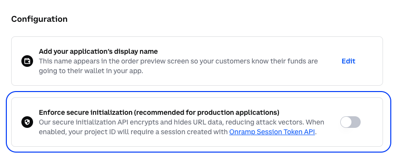
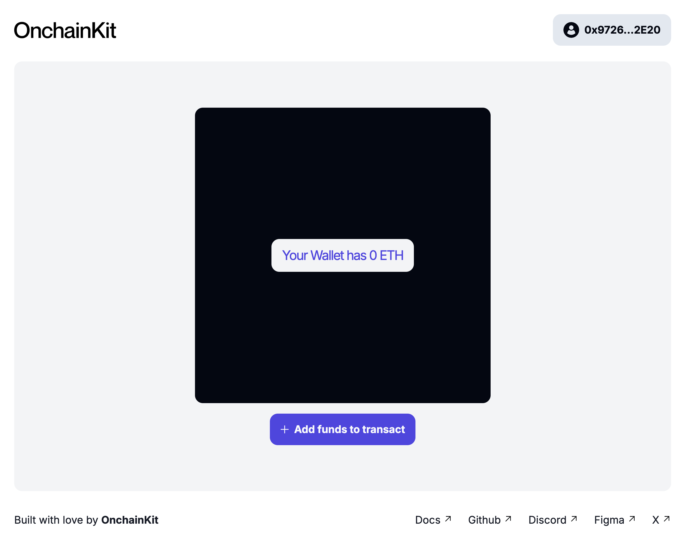
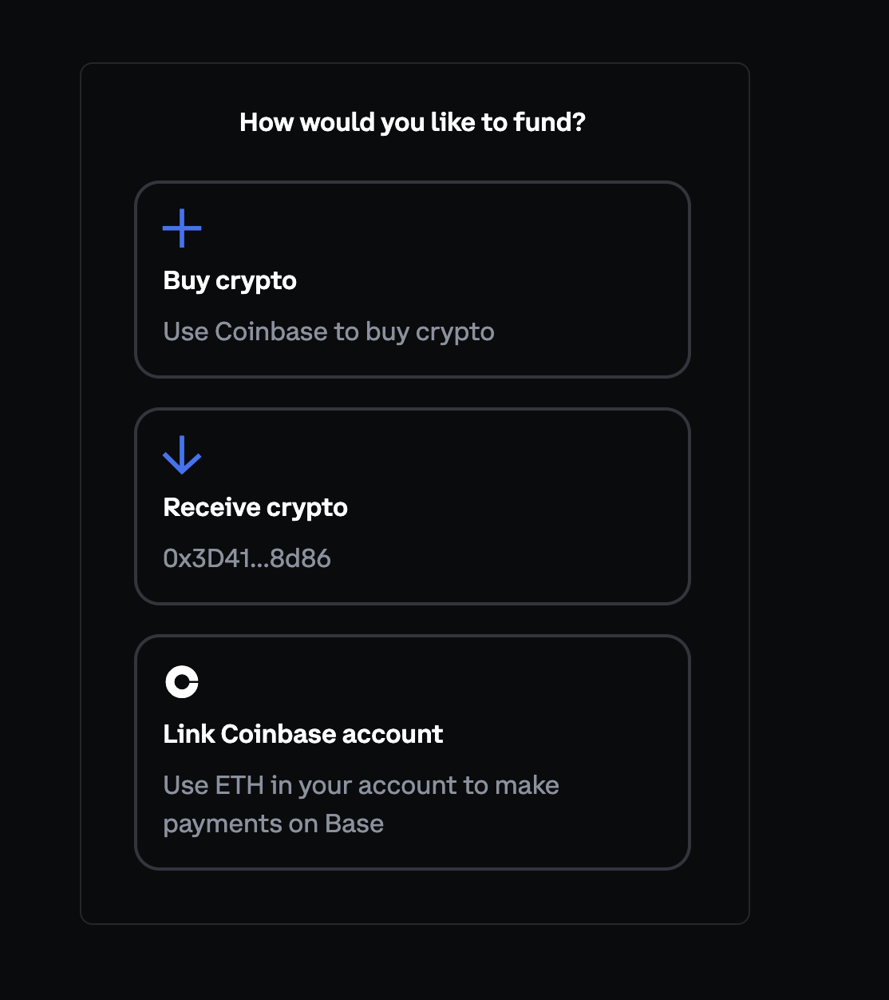

In this tutorial, you'll learn how to build an onchain app that checks a user's wallet balance and either allows them to mint an NFT or prompts them to add funds. We'll use the OnchainKit App Template as a starting point.

---

## Objectives

By the end of this tutorial you should be able to:

- Set up a project using the [OnchainKit App Template]
- Configure the app for to onboard users easily using [Smart Wallets]
- Implement balance checking and conditional rendering
- Use the Fund component to allow users to add buy tokens from their wallet without leaving your app

## Prerequisites

### React and TypeScript

You should be familiar with React and TypeScript. If you're new to these technologies, consider reviewing their [official documentation] first.

### OnchainKit

This tutorial uses Coinbase's OnchainKit. Familiarity with its basic concepts will be helpful.

### Access to the Coinbase Developer Platform

You'll need to set up an account on with [Coinbase Developer Platform (CDP) Account](https://www.coinbase.com/cloud). The CDP provides various tools and services for blockchain development, including access to API endpoints and other resources that will be instrumental in your project. Once you've created your account, you'll be ready to move forward with integrating these services into your application.

:::tip CDP Configurations

If you see a "something went wrong" error message when navigating to pay.coinbase.com, make sure you have "enforce secure initialization" disabled on the [Onramp config page] in Coinbase Developer Platform Dashboard.


:::

---

## Setting up the Project

To get started, clone the OnchainKit App Template by running:

```bash
git clone git@github.com:coinbase/onchain-app-template.git
```

in your terminal, then navigate into the project directory with:

```bash
cd onchain-app-template
```

Next, install the necessary dependencies by executing `bun install` followed by `bun install viem`.

After setting up the project, you'll need to configure your environment variables. Create a `.env` file in the root directory of your project and add the following line: `NEXT_PUBLIC_WC_PROJECT_ID=your_project_id_here`. Remember to replace 'your_project_id_here' with your actual project ID. Additionally, don't forget to configure your apiKey in the `src/app/components/OnchainProviders.tsx` file.

## Configuring for Smart Wallets

To make the app work only with smart wallets, modify `src/wagmi.ts`:

```typescript
// Inside the useWagmiConfig() function, before the useMemo() hook
coinbaseWallet.preference = 'smartWalletOnly';
```

## Implementing Balance Checking

Now well implement a check on the user's wallet to see if they have enough funds. Before we implement this check, let's create a helper function that grabs the user's Ethereum balance using [viem]. To do so, create a `utils.ts` file in the `src` directory that creates a client connected to Base and fetches the user's ETH balance:

```typescript
import { createPublicClient, http } from 'viem';
import { base } from 'viem/chains';
import type { GetBalanceParameters } from 'viem';

const publicClient = createPublicClient({
  transport: http(),
  chain: base,
});

export async function getBalance(address: GetBalanceParameters) {
  const balance = publicClient.getBalance(address);
  return balance;
}
```

Next, import the `getBalance()` function into your main component file (e.g., `src/app/page.tsx`). You will want to add a few [react hooks] to fetch the balance and store it as a state variable. Add the following lines of code to your `page.tsx` file:

```typescript
import { useState, useEffect } from 'react';
import { getBalance } from '../utils';
import { FundButton } from '@coinbase/onchainkit/fund';

// Inside your component
const [walletBalance, setWalletBalance] = useState('');

useEffect(() => {
  async function fetchBalance() {
    if (address) {
      const balance = await getBalance({ address });
      setWalletBalance(String(balance));
    }
  }
  fetchBalance();
}, [address]);
```

## Implementing Conditional Rendering

Now that we know the user's balance, we can then have them mint an NFT or prompt them to fund their wallet if they do not have enough ETH.

The end state is to show their balance along with the appropriate call to actions like so:



Update your component's return statement with the following code:

```typescript
return (
  <div className="flex h-full w-96 max-w-full flex-col px-1 md:w-[1008px]">
    {/* ... other sections ... */}
    <section className="templateSection flex w-full flex-col items-center justify-center gap-4 rounded-xl bg-gray-100 px-2 py-4 md:grow">
      <div className="flex h-[450px] w-[450px] max-w-full items-center justify-center rounded-xl bg-[#030712]">
        <div className="rounded-xl bg-[#F3F4F6] px-4 py-[11px]">
          <p className="text-xl font-normal not-italic tracking-[-1.2px] text-indigo-600">
            Your Wallet has {walletBalance} ETH
          </p>
        </div>
      </div>
      {address ? (
        parseFloat(walletBalance) > 0 ? (
          <TransactionWrapper address={address} />
        ) : (
          <FundButton text={'Add funds to transact'} />
        )
      ) : (
        <WalletWrapper className="w-[450px] max-w-full" text="Sign in to transact" />
      )}
    </section>
    <Footer />
  </div>
);
```

Sweet! Now our conditional rendering is in full force. If a user clicks on the `+ Add funds to transact` button they will be given three options for topping up their smart wallet:



## Conclusion

Congratulations! You've built a app that checks a user's smart wallet balance and provides appropriate options based on their funds.
This app can serve as a foundation for more complex onchain applications that require users to have funded smart wallets.

---

[OnchainKit]: https://github.com/coinbase/onchainkit
[OnchainKit App Template]: https://github.com/coinbase/onchain-app-template
[Viem]: https://viem.sh/
[Smart Wallets]: https://keys.coinbase.com/onboarding
[viem]: https://viem.sh/docs/introduction
[react hooks]: https://react.dev/reference/react/hooks
[Onramp config page]: https://portal.cdp.coinbase.com/products/onramp
[official documentation]: https://react.dev/
