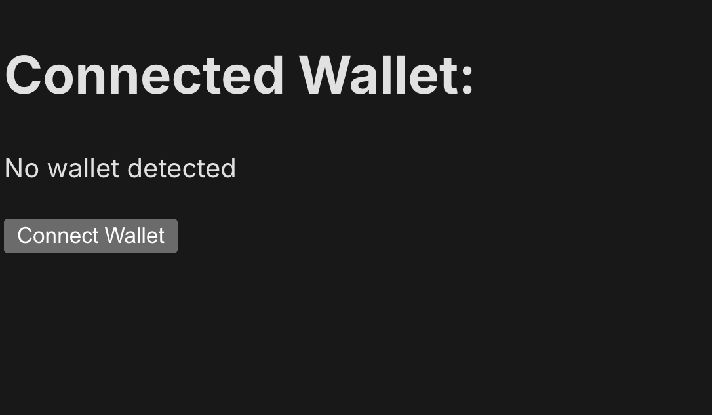
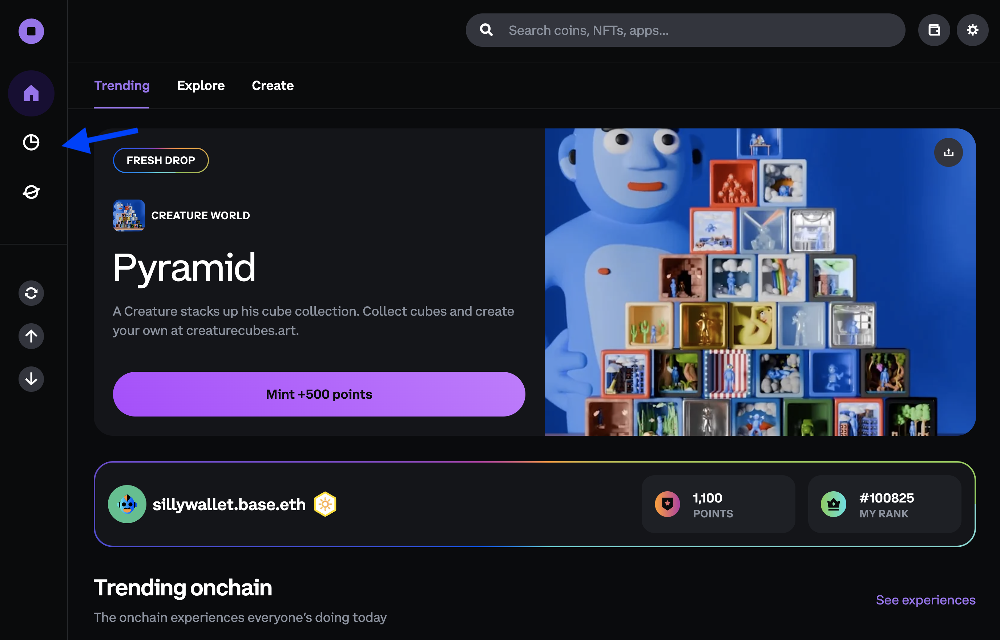
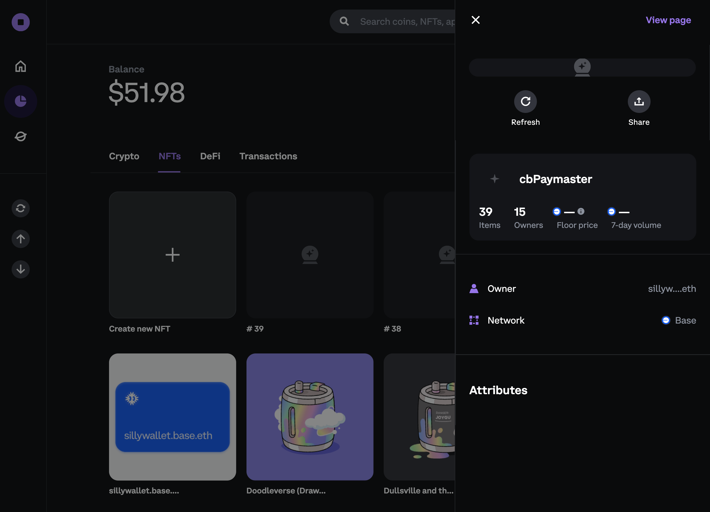

# How to Implement Base Paymaster into a Wagmi Project

In this tutorial, we’ll create a **Mint** button that allows users to mint an NFT for free through transaction sponsorship from a **Base Paymaster**. This setup enables users to mint NFTs directly to their wallets without incurring gas fees. By the end, you’ll have a fully functional NFT minting setup with transaction sponsorship via the Base Paymaster. Let's build!

## Objectives

- **Configure Wagmi for the Base Network**  
  Set up your Wagmi project to seamlessly interact with the Base blockchain, allowing users to connect their wallets and initiate transactions with ease.

- **Define Essential Constants**  
  Learn how to manage key information such as contract ABIs and addresses, which are crucial for interacting with smart contracts in your application.

- **Implement Paymaster-Sponsored NFT Minting**  
  Update onchain actions using Wagmi's `writeContracts` and `useCalls` hooks to enable gas-free NFT minting, allowing users to mint directly to their wallets without incurring transaction fees.

- **Enhance User Experience with Gasless Transactions**  
  Create a user-friendly experience by abstracting away the concept of gas fees, making it easier for users to engage with your application and mint NFTs.

## Prerequisites

### Wallet Connect Project ID

You’ll need to set up a cloud account with [Reown] (FKA, WalletConnect), a protocol that enables secure wallet connections across different platforms.

### Base Paymaster + Bundler Endpoint

You'll need to set up an account (free) with the [Coinbase Developer Platform (CDP)](https://www.coinbase.com/cloud) to obtain a Paymaster + Bundler endpoint, which is required for this tutorial. The CDP provides these essential services that enable transaction sponsorship.

### Smart Wallet

Smart Wallets enables users to create an account in seconds with no app or extension required through the use of Passskey signing. This tutorial uses the [Base Wallet] (FKA Coinbase Smart Wallet) to sign and mint transactions.

---

## Set Up Your Project

### Create a New Wagmi Project

Start by creating a new Wagmi project with Bun:

```bash
bun create wagmi
```

### Add WalletConnect Project ID

Add your WalletConnect Project ID to the .env file to enable wallet connection in the app. Open the .env file and add the following lines:

```
NEXT_PUBLIC_WC_PROJECT_ID=<YOUR_PROJECT_ID>
NEXT_TELEMETRY_DISABLED=1
```

Replace`<YOUR_PROJECT_ID>` with your actual WalletConnect Project ID.

### Update Wagmi Configuration

### Configure Wagmi for Base Network To integrate the Base network with Wagmi, update `wagmi.ts` as follows:

```ts
import { http, cookieStorage, createConfig, createStorage } from 'wagmi';
import { base } from 'wagmi/chains';
import { coinbaseWallet, injected, walletConnect } from 'wagmi/connectors';

export function getConfig() {
  return createConfig({
    chains: [base],
    connectors: [
      injected(),
      coinbaseWallet(),
      walletConnect({ projectId: process.env.NEXT_PUBLIC_WC_PROJECT_ID }),
    ],
    storage: createStorage({
      storage: cookieStorage,
    }),
    ssr: true,
    transports: {
      [base.id]: http(),
    },
  });
}

declare module 'wagmi' {
  interface Register {
    config: ReturnType<typeof getConfig>;
  }
}
```

This configuration sets up your project to connect to the Base network and supports multiple connectors, including WalletConnect.

### Create utils.ts for Contract ABI and Address

Create a new file `utils.ts` in the `src` folder. This file will store the contract’s ABI and address.

**`src/utils.ts`**

```ts
// utils.js

import { Abi } from 'viem';

export const contractAddress = '0x83bd615eb93ee1336aca53e185b03b54ff4a17e8' as `0x${string}`;

export const abi = [
  {
    type: 'constructor',
    inputs: [
      { name: '_name', type: 'string', internalType: 'string' },
      { name: '_symbol', type: 'string', internalType: 'string' },
    ],
    stateMutability: 'nonpayable',
  },
  // ABI code here
] as Abi;
```

Replace the contract address and ABI as per your contract’s details.

## Create the NFT Minting Page

In this step, we’ll create a new page in our project where users can mint an NFT. The minting page will use Wagmi’s hooks, including [`useCapabilities`][useCapabilities] to check the capabilities supported by the connected wallet and [`useWriteContracts`][useWriteContracts] to execute a mint function on our smart contract.

### Set Up `mint/page.tsx`

In your project’s `src/app` folder, create a new file called `mint/page.tsx`. This file will contain the code to manage wallet connection, check for paymaster capabilities, and execute the minting action.

:::info Experimenal Hooks and Capabilities

To ensure a smooth, gas-free NFT minting experience, it’s important to understand the purpose of two key hooks from Wagmi:

- **[`useCapabilities`][useCapabilities]:** This hook retrieves the list of capabilities (such as `paymasterService`) supported by the connected wallet, grouped by chain ID. This is crucial because we need to confirm that the connected wallet supports paymaster sponsorship, which allows transactions to be sponsored by a third party (in this case, Base Paymaster).

- **[`useWriteContracts`][useWriteContracts]:** This hook allows us to interact with smart contracts on the blockchain. Specifically, we’ll use it to trigger the `mintTo` function, which will mint an NFT to the user’s wallet.

By combining these hooks, we can detect whether the user’s wallet is capable of sponsored transactions and, if so, use the `writeContracts` function to mint an NFT without charging the user any gas fees.

:::

### Add the Code for NFT Minting

**For Wallet Connection:**
We use useAccount, useConnect, and useDisconnect to manage wallet connection. This allows users to connect via Coinbase Smart Wallet and disconnect as needed.

```tsx

'use client';
import { useAccount, useConnect, useDisconnect } from 'wagmi';
import { useState, useMemo } from 'react';
import { coinbaseWallet } from 'wagmi/connectors';
import { abi, contractAddress } from '../utils';
import { useCapabilities, useWriteContracts } from 'wagmi/experimental';

export default function Home() {
  const { address, isConnected } = useAccount();
  const { connect } = useConnect();
  const { disconnect } = useDisconnect();
  const [isMinting, setIsMinting] = useState(false);
  const [id, setId] = useState<string | undefined>(undefined);

  // Follow along for more code ...
```

**Capabilities Check with `useCapabilities`:**
Using `useCapabilities`, we retrieve the wallet’s supported capabilities, grouped by chain ID. In this example, we’re checking if the wallet has the `paymasterService` capability, which indicates it can use a Base Paymaster for gas-free transactions. If paymaster service is supported, we configure the capabilities object to include the Base Paymaster URL.

```tsx
// Retrieve wallet capabilities to check for paymaster support
const { data: availableCapabilities } = useCapabilities({
  account: address,
});
const capabilities = useMemo(() => {
  if (!availableCapabilities || !address) return {};
  const capabilitiesForChain = availableCapabilities[address.chainId];
  if (
    capabilitiesForChain['paymasterService'] &&
    capabilitiesForChain['paymasterService'].supported
  ) {
    return {
      paymasterService: {
        url: `https://api.developer.coinbase.com/rpc/v1/base/rcNfIncd3jL3FztkZ7TPOV_sfHUGlcVP`,
      },
    };
  }
  return {};
}, [availableCapabilities, address]);
```

**Minting Logic with `useWriteContracts`:**
We use `useWriteContracts` to interact with the smart contract and call the mintTo function, which mints the NFT. By passing capabilities, the transaction is sponsored by the Base Paymaster, covering gas fees for the user.

The Mint button will either prompt the user to connect their wallet (if not connected), or execute the handleMint function to mint an NFT (if connected). During the minting process, the button shows “Minting…” to indicate the ongoing transaction.

The full `src/app/mint/page.tsx` file should look something like this:

:::tip Smart Wallet Only

To enable [Base Wallet] functionality add the `smartWalletOnly` prefence to the [wagmi connector]

```jsx
<button
    onClick={
    isConnected
        ? handleMint
        : () =>
            connect({
            connector: coinbaseWallet({
                preference: 'smartWalletOnly',
            }),
            })
    }
    className='bg-blue-500 hover:bg-blue-700 text-white font-bold py-2 px-4 rounded'
    disabled={isMinting}
>
```

:::

```tsx
'use client';
import { useAccount, useConnect, useDisconnect } from 'wagmi';
import { useState, useMemo } from 'react';
import { coinbaseWallet } from 'wagmi/connectors';
import { abi, contractAddress } from '../utils';
import { useCapabilities, useWriteContracts } from 'wagmi/experimental';

export default function Home() {
  const { address, isConnected } = useAccount();
  const { connect } = useConnect();
  const { disconnect } = useDisconnect();
  const [isMinting, setIsMinting] = useState(false);
  const [id, setId] = useState<string | undefined>(undefined);

  // Use writeContracts to execute the mint function on our contract
  const { writeContracts } = useWriteContracts({
    mutation: { onSuccess: (id) => setId(id) },
  });

  // Function to handle the minting process
  const handleMint = async () => {
    setIsMinting(true);
    try {
      console.log('Minting NFT...');
      writeContracts({
        contracts: [
          {
            address: contractAddress,
            abi,
            functionName: 'mintTo',
            args: [address],
          },
        ],
        capabilities,
      });
    } catch (error) {
      console.error('Error minting NFT:', error);
    } finally {
      setIsMinting(false);
    }
  };

  // Retrieve wallet capabilities to check for paymaster support
  const { data: availableCapabilities } = useCapabilities({
    account: address,
  });
  const capabilities = useMemo(() => {
    if (!availableCapabilities || !address) return {};
    const capabilitiesForChain = availableCapabilities[address.chainId];
    if (
      capabilitiesForChain['paymasterService'] &&
      capabilitiesForChain['paymasterService'].supported
    ) {
      return {
        paymasterService: {
          url: `https://api.developer.coinbase.com/rpc/v1/base/rcNfIncd3jL3FztkZ7TPOV_sfHUGlcVP`,
        },
      };
    }
    return {};
  }, [availableCapabilities, address]);

  return (
    <div className="flex min-h-screen items-center justify-center">
      <div>
        <h1>Connected Wallet: </h1>
        <p>{address ? address : 'No wallet detected'}</p>
      </div>
      <div>
        {isConnected && (
          <button type="button" onClick={() => disconnect()}>
            Disconnect
          </button>
        )}
      </div>
      <button
        onClick={
          isConnected
            ? handleMint
            : () =>
                connect({
                  connector: coinbaseWallet({
                    preference: 'smartWalletOnly',
                  }),
                })
        }
        className="rounded bg-blue-500 px-4 py-2 font-bold text-white hover:bg-blue-700"
        disabled={isMinting}
      >
        {isMinting ? 'Minting...' : isConnected ? 'Mint NFT' : 'Connect Wallet'}
      </button>
    </div>
  );
}
```

This component detects if a wallet is connected, then allows users to mint an NFT. If no wallet is detected, it prompts the user to connect via the Coinbase Smart Wallet.

### Testing

Start your development server to test the minting functionality:

```bash
bun run dev
```

Open your browser and navigate to your site’s local URL:

```bash

http://localhost:3000/mint
```



**Connect Your Wallet and Mint**
Once on the mint page, connect your wallet. You should see a Mint button appear. Upon clicking the Mint button, a smart wallet popup will prompt you to confirm the mint transaction.


## Verify Your NFT

After minting, you can verify the NFT in your Base Wallet:

Go to [Coinbase Wallet](https://wallet.coinbase.com/).

Navigate to the **Assets** section and select the [**NFT** tab](https://wallet.coinbase.com/assets/nft).



You should see your newly minted NFT in your collection.



## Conclusion

Congratulations! You’ve successfully integrated a Base Paymaster to enable gas-free NFT minting within your Wagmi project. By configuring your project with Base network support, defining contract details, and using Wagmi hooks for minting, you’ve created a user-friendly, gasless minting experience. Now your users can mint NFTs without transaction costs, enhancing both accessibility and engagement with your app.

Happy building!

---

[OnchainKit]: https://github.com/coinbase/onchainkit
[Viem]: https://viem.sh/
[Smart Wallets]: https://keys.coinbase.com/onboarding
[viem]: https://viem.sh/docs/introduction
[react hooks]: https://react.dev/reference/react/hooks
[Onramp config page]: https://portal.cdp.coinbase.com/products/onramp
[official documentation]: https://react.dev/
[useWriteContracts]: https://wagmi.sh/react/api/hooks/useWriteContract
[useCapabilities]: https://wagmi.sh/react/api/hooks/useCapabilities
[wagmi connector]: https://wagmi.sh/core/api/actions/connect#connect
[Base Wallet]: https://www.smartwallet.dev/
