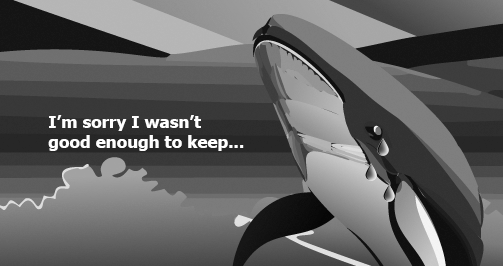
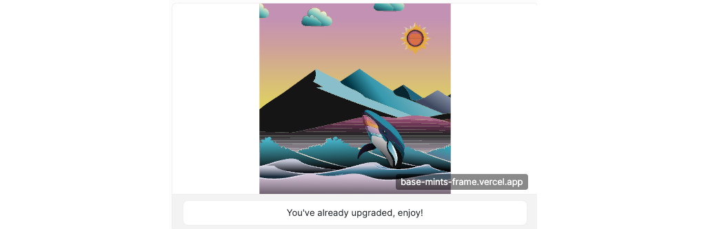

[Frames] have taken the [Farcaster] world by storm. They allow you to place a small onchain app inside of a cast! In this tutorial, we'll show you how to build your first frame using [OnchainKit], and our [a-frame-in-100-lines]

:::caution

Frames are brand new and tools are evolving quickly. Check the links above for changelogs!

:::

---

## Objectives

By the end of this tutorial you should be able to:

- Build a [Farcaster] Frame with a mint and airdrop function
- Use the [Basescan] API to find the owner of an NFT
- Pull the `tokenUri` from a contract and use it to show the real art

---

## Prerequisites

### ERC-721 Tokens

This tutorial assumes that you are able to write, test, and deploy your own ERC-721 tokens using the Solidity programming language. If you need to learn that first, check out our content in [Base Camp] or the sections specific to [ERC-721 Tokens]!

### Onchain App Development

You'll need to be comfortable building onchain apps.

### Vercel

You'll need to be comfortable deploying your app to [Vercel], or using another solution on your own.

### Farcaster

You must have a [Farcaster] account with a connected wallet. Check out the [Base channel] to stay in the loop when we release tutorials like this!

---

## Setup and Testing the Template

Start by creating a fork of the [a-frame-in-100-lines].

Run `yarn install`, then `yarn dev`.

In the browser, open `http://localhost:3000/`. All you'll see is a heading with _Zizzamia.xyz_. This is expected!

Open `page.tsx`. Here, you'll find the initial setup of the metadata that Farcaster reads to create the frame, as well as the simple page you just viewed. Change the heading to use your name.

Long term, you'd probably want to put something there, as the cast **must** have a link to this page. Currently, it's pretty common for the community to just skip that part. The cool stuff is in the Frame!

Deploy your project with [Vercel], then open it at the root. Again, you'll see the simple page, now with your name!

### Testing the Cast

To cast a frame, you'd simply paste this URL into when you create a cast, and it will work automagically!

But you probably want to use the [Frame Validator] first. Open that up, and paste in your link. Click `Load`. You should see:


Click, and the image will change. The button will also show the address of the interacting user. That's you!

Open up `api/frame/route.ts`. This file handles the route in `post_url` that is called when you click the button.

The route:

- Uses `getFrameMessage` from `onchainkit` to validate and interpret the request
- Pulls the user's wallet address from the `message`
- Sends a `NextResponse` containing a new frame, which is then displayed to the user

## Building A Mint Frame

Currently, you can't get the user to authorize a transaction from a frame, so you'll have to foot the bill to do a mint.

Our strategy uses the contract from the [Onchain NFTs] tutorial, modified so that a designated address can mint for a provided address:

```solidity
function mintFor(address _recipient) public onlyOwner {
  if(counter >= maxSupply) {
    revert MaxSupplyReached();
  }
  if(minted[_recipient]) {
    revert OneMintPerAddress();
  }
  minted[_recipient] = true;
  counter++;
  _safeMint(_recipient, counter);
}
```

You'll also want to keep track of addresses that have already minted, to prevent a few spammers from claiming all the NFTs!

**ADD .env.local to .gitignore. If you don’t do this you are going to expose your key and lose your wallet!**

:::danger

Make sure you added `.env.local` to ``.gitignore`!

:::

Create `.env.local` and add:

- BASESCAN_API_KEY - https://basescan.org/myapikey
- NFT_CONTRACT_ADDRESS - As described above
- WALLET_PRIVATE_KEY - the private key of the wallet that owns the above NFT contract and can mint it. **This key is the same as your 12-word phrase**

Install dotenv with `yarn add dotenv`, then open `route.ts`.

Add a new image in the `public` folder. Per the [Frames] docs, images must have a 1.91 to 1 aspect ratio. We used a grey-scale copy of the NFT, but others show the full image, or another call to action.

For now, just use something you'll recognize as a placeholder.

In **both** `page.tsx` and `route.ts`, change `NEXT_PUBLIC_URL` to the root of your deployment.

Change the image link in both files to the new image you added in `public`. Next automatically makes these available at `your-site.vercel.app/your-image.png`.

Redeploy and test the Frame again.

You'll probably see the old image. This is because Farcaster caches your Frame pretty aggressively. To get around this, you can put junk data in the url. We use a number that we iterate manually, to help keep track of new tests. For example

`my-farcaster-frame.vercel.app?13` for the 13th test.

### The Image Route

If your NFTs are unique, you'll want to get the picture of the actual NFT once the user mints. If you're not using unique NFTs, skip this part. It's more efficient to keep a local copy of the art in `public` and save some API calls.

Add a route to get the image. Right now, this can just return the existing image:

```typescript
import { NextResponse } from 'next/server';

export async function GET() {
  const img = await fetch('https://land-sea-and-sky.vercel.app/lss-bw.png').then((res) =>
    res.blob(),
  );
  return new NextResponse(img, {
    status: 200,
    headers: {
      'Content-Type': 'image/png',
      'Cache-Control': 'max-age=10',
    },
  });
}
```

Update both `route.ts` and `page.tsx` to use this route for the image:

```typescript
// page.tsx
const imageUrl = 'https://land-sea-and-sky.vercel.app/api/images/nft';

const frameMetadata = getFrameMetadata({
  buttons: [
    {
      label: 'Click Me',
    },
  ],
  image: imageUrl,
  post_url: `${NEXT_PUBLIC_URL}/api/frame`,
});

export const metadata: Metadata = {
  title: 'zizzamia.xyz',
  description: 'LFG',
  openGraph: {
    title: 'zizzamia.xyz',
    description: 'LFG',
    images: [imageUrl],
  },
  other: {
    ...frameMetadata,
  },
};
```

```typescript
// route.ts
return new NextResponse(
  getFrameHtmlResponse({
    buttons: [
      {
        label: `🌲 ${accountAddress} 🌲`,
      },
    ],
    image: imageUrl,
    post_url: `${NEXT_PUBLIC_URL}/api/frame`,
  }),
);
```

Redeploy and test!

## Setting up the Contract

Import your deployment artifact, if you're using Hardhat. If you're using Foundry, or another tool, adapt as appropriate to get the ABI and contract address.

Add your wallet key, and a provider url to your ``.env.local`, then import them as well.

```typescript
import LandSeaSkyNFT from '../constants/LandSeaSkyNFT.json';

require('dotenv').config();

const WALLET_PRIVATE_KEY = process.env.WALLET_PRIVATE_KEY;
const PROVIDER_URL = process.env.PROVIDER_URL;
```

Install [viem] with `yarn add viem`.

Import:

```typescript
import { privateKeyToAccount } from 'viem/accounts';
import { baseSepolia } from 'viem/chains';
import { createWalletClient, http } from 'viem';
```

Create a ` walletClient`` from the account, created from the private key, and a  `publicClient`` to read from the blockchain.

```typescript
const nftOwnerAccount = privateKeyToAccount(WALLET_PRIVATE_KEY as `0x${string}`);
const nftOwnerClient = createWalletClient({
  account: nftOwnerAccount,
  chain: baseSepolia,
  transport: http(PROVIDER_URL as string),
});

const publicClient = createPublicClient({
  chain: baseSepolia,
  transport: http(PROVIDER_URL as string),
});
```

Use the address of the Farcaster user, conveniently provided by the template and OnchainKit, to check whether or not the user has minted the NFT:

```typescript
let minted = false;

try {
  minted = !!(await publicClient.readContract({
    address: LandSeaSkyNFT.address as `0x${string}`,
    abi: LandSeaSkyNFT.abi,
    functionName: 'minted',
    args: [accountAddress],
  }));
} catch (err) {
  console.error(err);
}
```

The double !! will force the response into a boolean.

## Updating the Frame

If the address has already minted an NFT, update the button to share a message thanking them, otherwise, try to mint and airdrop an NFT:

```typescript
if (minted) {
  return new NextResponse(
    getFrameHtmlResponse({
      buttons: [
        {
          label: 'You already minted, thanks!',
        },
      ],
      image: imageUrl,
    }),
  );
} else {
  // Try to mint and airdrop the NFT
  try {
    const { request } = await publicClient.simulateContract({
      account: nftOwnerAccount,
      address: LandSeaSkyNFT.address as `0x${string}`,
      abi: LandSeaSkyNFT.abi,
      functionName: 'mintFor',
      args: [accountAddress],
    });
    await nftOwnerClient.writeContract(request);
  } catch (err) {
    console.error(err);
  }
  if (minted) {
  return new NextResponse(
    getFrameHtmlResponse({
      buttons: [
        {
          label: 'Thanks for minting!',
        },
      ],
      image: imageUrl,
    }),
  );
}
```

**Update your environment variables in Vercel** then redeploy and test. You won't see a different image, but you'll be able to see the transactions on [Basescan].

Don't forget to add a new number ( `?15` ) to your url when testing!

## Showing the Real NFT Image

Now, it's time to make the frame show the user's NFT, if they have one. Because [Land, Sea, and Sky], the sample from [Complex Onchain NFTs] generates a unique NFT for each user, you'll need to use a third-party api to get the user's NFT id, then fetch the tokenURI for that NFT.

First, change your button on the first page to represent the new use case: `"Mint or View NFT"`.

Open `route.ts` for the image endpoint.

Update it to grab query parameters from your endpoint, and show the grayscale image if either is missing:

```typescript
const url = new URL(req.url);
  const queryParams = url.searchParams;

  const { minted, address } = Object.fromEntries(queryParams.entries());
  console.log({ minted, address });


  if (!minted || !address) {
      const img = await fetch('https://land-sea-and-sky.vercel.app/lss-bw.png').then((res) => res.blob());
      return new NextResponse(img, {
          status: 200,
          headers: {
              'Content-Type': 'image/png',
              'Cache-Control': 'max-age=10',
          }
      });
  } else {
      // Find out if the address still owns the NFT, and if so, what the token ID is

  }
}

```

You'll use the Basescan api to find the token information. Add your api key to your .env if you didn't already. Note that Basescan and Etherscan use different keys

There isn't an sdk to install.

Add a folder inside `app` called `types` and a file called `index.ts` inside that. Add the types for etherscan api responses:

```typescript
// @dev values taken from sample response
export type EtherscanEventResponse = {
  blockNumber: string;
  timeStamp: string;
  hash: string;
  nonce: string;
  blockHash: string;
  from: string;
  contractAddress: string;
  to: string;
  tokenID: string;
  tokenName: string;
  tokenSymbol: string;
  tokenDecimal: string;
  transactionIndex: string;
  gas: string;
  gasPrice: string;
  gasUsed: string;
  cumulativeGasUsed: string;
  input: string;
  confirmations: string;
};

export type EtherscanResponse = {
  status: '0' | '1';
  message: string;
  result: EtherscanEventResponse[];
};
```

Import these into the image route:

```typescript
import { EtherscanResponse } from '../../../types';
```

Use the etherscan API to get a list of ERC721 Transfer Events for the address for the contract, filter that list to remove any NFT ids that were given away.

```typescript
if (!minted || !address) {
  // Send the grayscale image
} else {
  // Find out of the address still owns the NFT, and if so, what the token ID is
  const API_URL = `https://api-sepolia.basescan.org/api?module=account&action=tokennfttx&contractaddress=${LandSeaSkyNFT.address}&address=${address}&sort=asc&apikey=${BASESCAN_API_KEY}`;
  const response = await fetch(API_URL);
  const json: EtherscanResponse = (await response.json()) as EtherscanResponse;

  const result = json.result;

  // Create a list of the token IDs where to matches the address
  const tokenIds = result
    .filter((tx) => tx.to === address.toLocaleLowerCase())
    .map((tx) => tx.tokenID);

  // Create a list of the token IDs where from matches the address
  const tokenIdsFrom = result
    .filter((tx) => tx.from === address.toLocaleLowerCase())
    .map((tx) => tx.tokenID);

  // Remove any token IDS that are in tokenIdsFrom from tokenIds
  const tokenIdsTo = tokenIds.filter((tokenId) => !tokenIdsFrom.includes(tokenId));
}
```

Add another image, to handle users that have minted your NFT, but don't anymore. We used a sad whale:



```typescript
if (tokenIdsTo.length === 0) {
  const img = await fetch('https://land-sea-and-sky.vercel.app/gave-me-away.png').then((res) =>
    res.blob(),
  );
  return new NextResponse(img, {
    status: 200,
    headers: {
      'Content-Type': 'image/png',
      'Cache-Control': 'max-age=10',
    },
  });
} else {
  // Get the actual NFT image from the contract
}
```

Otherwise, create a viem public client and call tokenURI with the id of the first token on the list

**Note**: This is not an elegant solution for if someone is gifted an NFT then mints their own!

You did this already in api/frame. Use the same pattern, but instead call `tokenURI` with the token id:

```typescript
// Get the actual NFT image from the contract
const publicClient = createPublicClient({
  chain: baseSepolia,
  transport: http(PROVIDER_URL as string),
});

let tokenMetadata = '';
try {
  tokenMetadata = (await publicClient.readContract({
    address: LandSeaSkyNFT.address as `0x${string}`,
    abi: LandSeaSkyNFT.abi,
    functionName: 'tokenURI',
    args: [tokenIdsTo[0]],
  })) as string;
} catch (err) {
  console.error(err);
}

console.log({ tokenMetadata });
```

The tokenURI for the sample contract returns the actual json metadata, json encoded, with the actual svg inside, also base64 encoded. You'll need to decode it, then return it.

```typescript
// Decode the base64 encoded JSON
const tokenMetadataJson = JSON.parse(atob(tokenMetadata.split(',')[1]));

// Then decode the base64 encoded svg image
const svg = atob(tokenMetadataJson.image.split(',')[1]);

// Create a blob from the svg
const img = new Blob([svg], { type: 'image/svg+xml' });

// Return the blob
return new NextResponse(img, {
  status: 200,
  headers: {
    'Content-Type': 'image/svg+xml',
    'Cache-Control': 'max-age=10',
  },
});
```

This works!

But Farcaster frames expect an image with a 1:91 to 1 ratio. We need to adjust the svg, and clip the extra content, since the svg has pieces that are intended to be out of frame:

```typescript
function frameSvgStringToBlob(originalSvgString: string): Blob {
  // Define the dimensions based on the 1.91:1 aspect ratio
  const originalSize = 1024;
  const newWidth = originalSize * 1.91; // 1955.84
  const centerX = newWidth / 2;
  const clipStartX = centerX - 512; // Start of the clip rectangle

  // Create the new SVG string and add a clipPath to clip the contents
  const framedSvgString = `
     <svg width="${newWidth}" height="${originalSize}" viewBox="0 0 ${newWidth} ${originalSize}" xmlns="http://www.w3.org/2000/svg">
       <defs>
         <clipPath id="clip">
           <!-- Set the clipping rectangle to start at clipStartX and be 1024 units wide -->
           <rect x="${clipStartX}" width="1024" height="${originalSize}" />
         </clipPath>
       </defs>
       <g clip-path="url(#clip)">
         ${originalSvgString}
       </g>
     </svg>
   `;

  // Convert the string to a blob
  const blob = new Blob([framedSvgString], { type: 'image/svg+xml' });

  return blob;
}
```

Call your new function, then return it:

```typescript
const img = new Blob([frameSvgStringToBlob(svg)], { type: 'image/svg+xml' });
// Return the blob
return new NextResponse(img, {
  status: 200,
  headers: {
    'Content-Type': 'image/svg+xml',
    'Cache-Control': 'max-age=10',
  },
});
```

:::caution
SVG images aren't working in Frames on mobile clients. Stay tuned on the Base channel for a fix!
:::

**Remember to update your envars in Vercel**, redeploy, and test. You'll now see your NFT in the frame!



## Up Next

In our next tutorial, soon to be released, we'll show you how to make gates to require users do an action before they mint, such as the recast gate in the original post for the Land, Sea, and Sky NFT.

---

## Conclusion

In this tutorial, you learned how to create [Farcaster] frames. You then updated it to airdrop an NFT to users who click the button in your frame. Finally, you learned how to pull real NFT images from the blockchain, and display them in your frames.

---

[Base Camp]: https://docs.base.org/base-camp/docs/welcome
[ERC-721 Tokens]: https://docs.base.org/base-camp/docs/erc-721-token/erc-721-standard-video
[testnet version of Opensea]: https://testnets.opensea.io/
[Farcaster]: https://www.farcaster.xyz/
[a-frame-in-100-lines]: https://github.com/Zizzamia/a-frame-in-100-lines
[OnchainKit]: https://github.com/coinbase/onchainkit
[Vercel]: https://vercel.com
[Frame Validator]: https://warpcast.com/~/developers/frames
[Base channel]: https://warpcast.com/~/channel/base
[Onchain NFTs]: /tutorials/onchain-nfts
[Frames]: https://warpcast.notion.site/Farcaster-Frames-4bd47fe97dc74a42a48d3a234636d8c5
[viem]: https://viem.sh/
[Basescan]: https://basescan.org/
[Land, Sea, and Sky]: https://github.com/base-org/land-sea-and-sky
