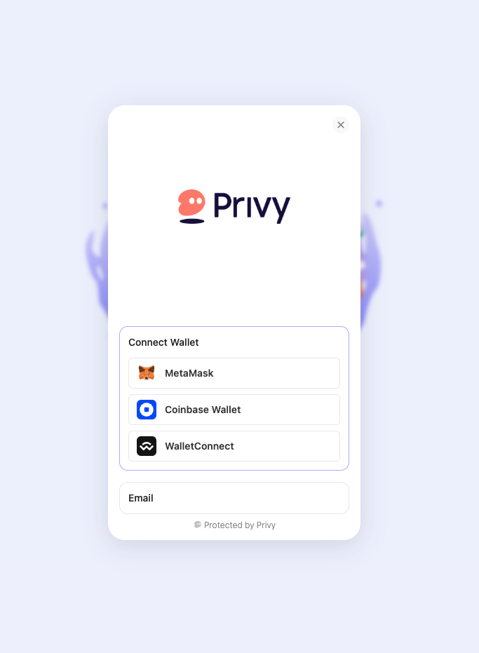
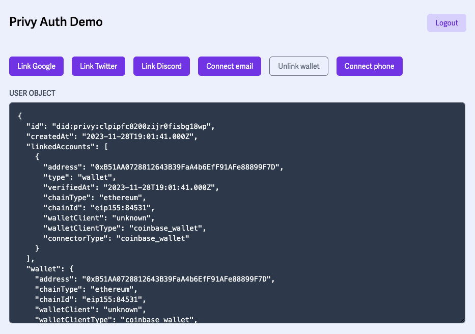
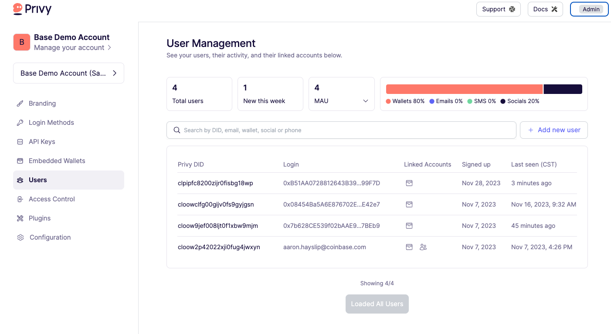
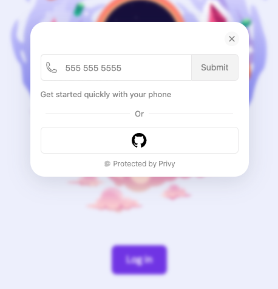

This tutorial shows you how to use [Privy], [Alchemy's Account Kit], and the [Base Paymaster] to enable your users to use onchain apps without creating a wallet on their own, or even needing to pay for gas fees!

---

## Objectives

By the end of this tutorial, you should be able to:

### Intro to Account Abstraction

- Explain how Account Abstraction can improve user experience for onchain apps
- Describe the difference between contract accounts and EOAs, the limitations of contract accounts, and how EIP-4337 uses `UserOperation`s to mitigate these limitations
- Outline how Account Abstraction works, and how users interact with smart contract wallets

### Intro to Privy

- Implement Privy's quick start to add onchain authentication to a NextJS application
- Compare Privy's progressive authentication strategy with traditional wallet-based authentication
- Use Privy's `PrivyProvider` context and `usePrivy` hook to implement basic authentication via an email address, SMS, EOA, and/or social auth
- Utilize Privy's Embedded Wallets to enable users to utilize wallet-based actions without having to connect to an external wallet or leave your application

### Implementing the Paymaster

- Describe how a third party can use a _paymaster_ to sponsor gas
- Modify Privy's Base [paymaster example] example to work in another app, using an EOA to allow a user to call a smart contract function without requiring the user to pay any gas

---

## Prerequisites

### 1. Be familiar with modern, frontend web development

In this tutorial, we'll be working with a React frontend built with [Next.js]. While you don't need to be an expert, we'll assume that you're comfortable with the basics.

### 2. Possess a general understanding of the EVM and smart contract development

This tutorial assumes that you're reasonably comfortable writing basic smart contracts. If you're just getting started, jump over to our [Base Learn] guides and start learning!

---

## Intro do Account Abstraction

[ERC-4337], also known as _Account Abstraction_, is a standard that allows smart contracts to initiate transactions, thus enabling any logic that users want to implement to be encoded into the smart contract wallet itself for execution on Ethereum.

Account Abstraction has the potential to be a massive game-changer for onchain user experience and many believe it will play a key role in bringing the next billion users onchain.

---

### The Problem Account Abstraction Solves

Onchain applications are difficult to use for many people, as they require a lengthy onboarding process for the average internet user who already onchain.

For example,the preliminary steps a user needs to go through before they can use an onchain app are:

1. Create a wallet (Coinbase Wallet, Metamask, etc)
1. Store the wallet mnemonic safely, without losing it or compromising it
1. Sign a slightly frightening message to connect to an onchain app
1. Try to do anything with the app and get a popup asking them to approve a transaction
1. Attempt to do so, learn transactions cost gas, and that they don't have any
1. Learn that gas is a fee that users must pay in ETH to use onchain apps
1. Attempt to buy ETH, possibly buying the wrong flavor of ETH in the wrong location
1. Try the transaction again
1. Repeat until they finally find the correct path

For widespread adoption of onchain applications, this confusing and alienating process has to change.

That's where Account Abstraction comes in. It allows you to improve the onboarding and usage flow for your users:

1. User goes to the onchain app and authenticates (using email, EOA, or social auth)
2. User uses the app
3. Transactions happen under the hood via a smart contract wallet and the app developer sponsors the user's gas fees until after they're onboarded.

To summarize, Account Abstraction enables smart contract accounts to initiate user operations, similar to how an EOA would initiate a transaction. However, unlike EOAs, smart contract accounts are programmable and can enable a number of incredible features, such as:

- **Sponsored Transactions**: Allow application owners to cover the users gas fees with a paymaster or allow a user to use something other than ETH (USDC, for example) to cover gas
- **Arbitrary Verification Logic**: Verify transactions with custom logic
- **Account Recovery**: Create account recovery features for when user lose private keys
- **Batching Transactions**: Change the user experience so that multiple transactions can be submitted at once

---

### Overview of ERC-4337 - Account Abstraction

"Account Abstraction" comes from [ERC-4337]. The proposal itself is a dense read, but one of stated goals of the proposal is to:

> allow users to use smart contract wallets containing arbitrary verification logic instead of EOAs as their primary account. Completely remove any need at all for users to also have EOAs (as status quo SC wallets and EIP-3074 both require)

In other words, the proposal seeks to allow users to use _smart contract wallets_ **instead** of EOAs to transact onchain.

:::info

You're working with something so new that the vocabulary hasn't settled yet. You'll often see the terms "smart contract wallet", "smart contract account" or just "smart account" used interchangeably.

:::

At first glance, you may be asking yourself if using smart contract accounts solve our problem. What's the difference between a smart contract account (or contract account) and an _Externally Owned Account_?

According to [ethereum.org], the differences are:

**Externally Owned Account**

- Creating an account costs nothing
- Can initiate transactions
- Transactions between externally-owned accounts can only be ETH/token transfers
- Made up of a cryptographic pair of keys: public and private keys that control account activities

**Contract Accounts**

- Creating a contract has a cost because you're using network storage
- Can only send transactions in response to receiving a transaction
- Transactions from an external account to a contract account can trigger code which can execute many different actions, such as transferring tokens or even creating a new contract
- Contract accounts don't have private keys. Instead, they are controlled by the logic of the smart contract code

Smart contract wallets _would_ solve our problems, **but**, as stated above, they can't initiate transactions. Since they cannot initiate transactions, users still need EOAs and those EOAs still need to pay for gas with ETH.

There were two options to resolve this problem:

1. Change the protocol - hard fork!

2. Change transactions, upstream (ERC-4337)

In a nutshell, ERC-4337 doesn't change how Ethereum transactions work. Cryptographically signed instructions from accounts still initiate transactions to update the state of the Ethereum network.

What ERC-4337 changes is everything _upstream_ of that signed transaction. It does this by introducing a new _user intent layer_ that acts as a proxy for an EOA. This layer allows users to initiate transactions, with highly customizable smart contract wallets, but without using an EOA. The Ethereum network still receives what it received before - signed transactions.

The result is a better experience for the user without changing the Ethereum protocol.

---

### How Account Abstraction Works

With typical Ethereum transactions an EOA initiates and signs a transaction. That transaction is sent to Ethereum's Public Mempool, is validated and added to a block, onchain.

Note that the following steps are primarily happening **before** any of that.

#### 1. **Smart Contract Wallet Creation**

First, a new smart contract wallet must be created for a user. This wallet is owned by its creator who is designated as the _signer_. This signer must validate any of its future operations.

This wallet may come with a variety of features, but it must be able to at least validate `UserOperations`s with a function called, `validateUserOp`. `validateUserOp` will check each `UserOperation`'s signature, increment the nonce, and handle the operation's fees.

#### 2. **User Operation Creation**

From the smart contract account, `UserOperations`s are created. These are not yet transactions, but rather represent intents from the user. These intents can represent any onchain user operation.

`UserOperation` includes the details of the transaction such as sender, nonce, gas limit, max fee per gas, paymaster data (if applicable), and a signature.

#### 3. **Signature Generation**:

The `UserOperation` is then signed using the private key associated with the initiating account. This signature serves to authenticate the transaction and validate that it was indeed initiated by the owner of the smart contract account.

#### 4. **Alt Mempool**:

ERC-4337 introduces an _Alt Mempool_ where operations are stored until they're picked up by a _Bundler_. The Alt Mempool is not very different from the transaction pool typically used in Ethereum, but this mempool exists earlier on in the transaction and holds user operations, where Ethereum's mempool holds signed transactions.

#### 5. **Bundler and Operation Submission**:

Nodes on the Ethereum network have the option to serve as a _Bundler_, a role that involves collecting multiple signed `UserOperation`s and consolidating them into a single transaction, called a bundle transaction. These bundle transactions are then directed towards a universal smart contract, called the _EntryPoint_.

The submission of the signed `UserOperation` to the EntryPoint contract can be done directly or through a _paymaster_, which is a contract that agrees to cover the cost of operations for certain users.

#### 6. **Operation Validation**:

The Bundler triggers a function named `handleOps` on the EntryPoint smart contract, which receives the bundle transaction. The EntryPoint then calls `validateUserOp` for each account within this bundle transaction.

Each smart contract wallet is then required to implement an additional function and execute the actual operation sent by the EntryPoint contract.

#### 7. **Operation Execution**:

Once the operation has been validated and the fees have been handled, the operation is executed on the Ethereum network.

---

## Intro to Privy

[Privy] makes authentication and user-management in onchain apps easier by bridging onchain and offchain user data. In preparation to dive into our Base Paymaster example app, this lesson will cover the basics of Privy.

In this tutorial, you'll quick start and review a sample application where users can authenticate with [Privy].

---

### Overview of Privy

Privy self-describes as "a simple toolkit for progressive authentication in web3". In this app, you'll primarily use Privy for its authentication and user-handling capabilities, but some of Privy's most popular features include:

**Authentication Options**: Privy allows developers to configure how users authenticate. This can be with a crypto wallet, an email address, phone number or social profiles. Conveniently, Privy handles sessions and provides all necessary authentication methods.

**Progressive Onboarding**: Privy creates a `user` object for each session. Before authentication, this `user` object is `null`, but as the user interacts with your application it will progressively associate more user information with this object. For example, users can start by authenticating with their email address and later add their wallet address or any other user information as the application requires.

**Embedded Wallets**: Embedded wallets are "self-custodial Ethereum wallets that are embedded into your app. This allows your users to take wallet-based actions without ever leaving your site. Embedded wallets are the easiest way to unlock your full product experience for users who don't have, or don't want to connect, their own wallet." Developers can simply configure Privy to automatically created an Embedded Wallet on `login` or they can be pregenerated on the backend.

:::caution

_Embedded wallets_ are still EOAs and should not be confused with _smart contract wallets_. A user may have both. During development, this division can lead to confusing situations where `msg.sender` is **not** the address you were expecting.

:::

---

### Privy Quick Start

As with most onchain frontend connector libraries, you can use [Privy's Quick Start] to jump start your development with their platform. In this example, you'll use the NextJS starter.

#### Setup

First, navigate to the repository: [https://github.com/privy-io/create-next-app] and clone the repo.

```bash
git clone https://github.com/privy-io/create-next-app
```

Next, `cd create-next-app` and install dependencies with `yarn`.

#### Setting Your App Id

To use Privy, you'll need your own environment variables. In your terminal, run:

```bash
cp .env.example .env.local
```

This will create a `.env.local` file in your project's root. This is where you'll add your Privy App ID:

```text
NEXT_PUBLIC_PRIVY_APP_ID=<your-privy-app-id>
```

:::info

Note - to get an App ID, you'll need to request one and access it at [https://console.privy.io/]. This process can take a while, but for the Base community, Privy will expedite this process! Developers can send an email to `base@privy.io` with:

- Your app name
- The email address you want as admin
- A one liner on what you're building

:::

#### Starting the App

Finally, run `yarn dev` and navigate to [http://localhost:3000] to see the starter application.

---

### Privy Login Walkthrough

Before exploring the code, test the app. First, you should see this login page:


After clicking "Log in" you'll see the following modal:



By default, you can login with a wallet, or email.

After logging in, you'll be redirected to the `/dashboard` page, where the demo app will allow you to connect a number of other accounts to your `user` object:



If you navigate to [console.privy.io](https://console.privy.io/), you'll see that Privy stores all your users and their data here.



---

### PrivyProvider

Diving into the code, first look at the `PrivyProvider` inside of `_app.jsx`:

```tsx
<PrivyProvider
  appId={process.env.NEXT_PUBLIC_PRIVY_APP_ID || ''}
  onSuccess={() => router.push('/dashboard')}
>
  <Component {...pageProps} />
</PrivyProvider>
```

`PrivyProvider` uses React Context and wraps any components that will use the `usePrivy` hook.

Additionally, it's here that you can pass an optional `config` property to enable more authentication methods.

Add a `config` property to the `<PrivyProvider />` in `_app.jsx` with `'github'` and `'sms'` as the login options:

```tsx
<PrivyProvider
  appId={process.env.NEXT_PUBLIC_PRIVY_APP_ID || ''}
  onSuccess={() => router.push('/dashboard')}
  config={{
    loginMethods: ['github', 'sms'],
  }}
>
  <Component {...pageProps} />
</PrivyProvider>
```

Refresh to see that authentication is only possible now through Github or SMS:



You can find a full list of `loginMethods` in the docs for [`PrivyClientConfig`].

---

### The `usePrivy` Hook

The primary method you'll use to utilize Privy's authentication features is `usePrivy`. Open `pages/dashboard.tsx` to see the methods decomposed from `usePrivy` in the starter, and how they are used.

A full list of the fields and methods returned from `usePrivy` are [documented here].

---

### The `useWallets` Hook

To access wallet data for currently authenticated user, use the `useWallets` hook:

```tsx
import { ConnectedWallet, useWallets } from '@privy-io/react-auth';

const { wallets } = useWallets();

// wallets = [
//   {
//     "address": "0x<address>",
//     "type": "wallet",
//     "verifiedAt": "2023-11-28T19:01:41.000Z",
//     "chainType": "ethereum",
//     "chainId": "eip155:84531",
//     "walletClient": "unknown",
//     "walletClientType": "coinbase_wallet",
//     "connectorType": "coinbase_wallet"
//   },
//   {
//     "address": "0x<address>",
//     "type": "wallet",
//     "verifiedAt": "2023-11-28T20:09:23.000Z",
//     "chainType": "ethereum",
//     "chainId": "eip155:1",
//     "walletClient": "unknown",
//     "walletClientType": "metamask",
//     "connectorType": "injected"
//   },
// ],
```

As you can see, a user may connect multiple wallets to Privy, including Embedded Wallets.

---

### Embedded Wallets

Lastly, configure your starter app to create an Embedded Wallet for your users on login.

As stated in the Privy docs,

> Embedded wallets are self-custodial Ethereum wallets that are embedded into your app. This allows your users to take wallet-based actions without ever leaving your site. Embedded wallets are the easiest way to unlock your full product experience for users who don't have, or don't want to connect, their own wallet.

When configuring your app to create embedded wallets on login, you have 2 options:

- `users-without-wallets`: This will create embedded wallets for all use who did not login with an external wallet
- `all-users`: This will create an additional embedded wallet for all users, regardless if they have linked an external wallet

Inside of `_app.tsx`, update your `PrivyProvider`:

```tsx
<PrivyProvider
  appId={process.env.NEXT_PUBLIC_PRIVY_APP_ID || ''}
  onSuccess={() => router.push('/dashboard')}
  config={{
    embeddedWallets: {
      createOnLogin: 'all-users'
    }
  }}
>
```

Log out of your application, then log in again and see that your user has an additional `linkedAccount` which is the Privy Embedded Wallet:

```tsx
{
  "address": "0xD5063967BA703D485e3Ca40Ecd61882dfa5F49b2",
  "type": "wallet",
  "verifiedAt": "2023-11-28T20:52:22.000Z",
  "chainType": "ethereum",
  "chainId": "eip155:1",
  "walletClient": "privy",
  "walletClientType": "privy",
  "connectorType": "embedded",
  "recoveryMethod": "privy"
},
```

More information on Privy's Embedded Wallets, including information about the addresses, signing transactions, funding the wallet and more, can be found here: [https://docs.privy.io/guide/frontend/embedded/overview]

---

## Implementing the Paymaster

A _paymaster_ is a type of smart contract account, introduced in [ERC-4337], that is able to pay for gas on behalf of another account. In this step-by-step, you'll modify an example created by [Privy], move it to another onchain app, and use it to call a smart contract function. Along the way, you'll encounter and resolve some of the confusing pitfalls associated with working with smart contract accounts.

:::caution

The tutorial below does not account for recent changes to the [Base Paymaster]. Please reference the linked repo and adjust. We'll update the tutorial soon!

:::

---

### Reviewing the Example

Start by reviewing the [paymaster example]. The address in the `about` section of the Github page links to a deployed version of the app. It's the same app you get from [Privy's Quick Start], with the addition of a mint button (the versions may be a little older).

The app is limited to social auth, so log in with either your Google account or email. You'll see the dashboard, with the addition of a `Mint NFT` button at the top.

Click the button and you'll see a toast notification informing you of updates to the transaction status. Note that this happens **without** you needing to approve a transaction or fund a wallet!

Click to see the transaction when it's done to open BaseScan. If you missed it, mint another NFT, it's not like you're paying gas!

---

### Reviewing the Transaction and Contract

The transaction page should appear fairly standard. You can see from it that an NFT was minted by the [NFT Contract] and transferred to the smart wallet address listed on the dashboard. Digging in a little more, you'll see some things that might be different than what you'd expect.

#### Tokens Transferred and the NFT Contract

In the `ERC-721 Tokens Transferred` section, click the link to `NFT Name (NFT)` to open up the overview page for the token. You'll see a list of transfers, with yours likely on the top. Click the address for the contract to open up the [view for the contract itself].

You may be surprised to see that there are very few transactions listed for this contract, despite the list of transfers you can see on the token page, or the `Events` tab. Currently, Etherscan and BaseScan won't display transactions done via the paymaster.

:::caution

Blockchain explorers are service providers that provide information about the state of various blockchains. They are **not** a source of truth.

It is possible for onchain activity to be missing from these services.

:::

#### The Bundler (Transaction Sender)

Return to the transactions summary and look at the `From:` field. It will contain `0x1e6754b227c6ae4b0ca61d82f79d60660737554a`. What is this address? It's not your smart wallet address or signer address. If you mint another NFT from a different login, you'll get the same sender.

This address is the [bundler], which is a special node that bundles user operations from the alt mempool into a single transaction and sends them to the single [EntryPoint] contract.

#### EntryPoint

The EntryPoint contract for Base Goerli is located at `0x5ff137d4b0fdcd49dca30c7cf57e578a026d2789`. Strangely, in your transaction receipt you'll see that the transaction includes a transfer of ETH **from** the EntryPoint **to** the bundler. This transaction is how the bundler gets compensated for performing the service of bundling user ops and turning them into transactions -- the EntryPoint calculates the gas used by user ops and multiplies that by the fee percentage and send it to the bundler.

---

### Review the Example Code

Return to the [paymaster example] and review the readme. The section on _Copying into your code_ lists the three files you'll need to copy over to implement the paymaster in your own app. All three are extensively documented via comments. You'll also want to review how the demo app uses these to call a function.

#### `SmartAccountContext.tsx`

The first file, [`hooks/SmartAccountContext.tsx`] uses a React Context provider to create a ` SmartAccountProvider`` and pass it into your app. You can see it in use in  `\_app.tsx`, with the regular `PrivyProvider` around it. Review the file in detail.

Starting on line 63, the exported `SmartAccountProvider` does the following:

1. Fetch the user's wallets and find their Privy wallet. This wallet is provided, and if need be created, by the `PrivyProvider`
1. Set up state variables to manage and share connection status and the smart account itself
1. Initialize an RPC client for the [Base Paymaster] (on Goerli). The URL is hardcoded in `lib/constants.ts`
1. Initialize an ERC-4337 RPC client for Alchemy's network. This network is where the bundler address comes from
1. Create a smart wallet. In this case, the `signer` is your EOA embedded wallet created by Privy and fetched in the first step
1. The EOA address is displayed in the example app as `YOUR SIGNER ADDRESS`
1. Initialize an Alchemy provider for the smart account signer, using Alchemy's [Account Kit].
1. This creates the smart account and its address, which is displayed in the example app as `YOUR SMART WALLET ADDRESS`

Finally, the `sendSponsoredUserOperation` function takes a traditional transaction, turns it into a user operation, adds the data for the paymaster to pay the gas, signs it, and sends it. Whew!

If you want a deeper dive into the inner workings of this process, review the helper functions in [`user-operations.ts`].

#### How to Call a Smart Contract Function with the Paymaster

Open [`pages/dashboard.tsx`] and take a look at the `onMint` function on line 32. This function is used as the `oncClick` handler for the `Mint` button at the top of the dashboard.

If you're used to working with wagmi, you'll find the process of sending and awaiting for confirmation of a transaction a little on the manual side. Most of this will be familiar if you've used viem directly, or have worked with _Ethers_.

When a user clicks, the app first creates a viem `RpcTransactionRequest` for the `mint` function on the smart contract. The `smartContractAddress` is supplied by the `SmartAccountProvider`, and the `ABI` and contract `NFT_ADDRESS` are loaded from `lib/constants.ts`:

```tsx
{
  from: smartAccountAddress,
  to: NFT_ADDRESS,
  data: encodeFunctionData({
    abi: ABI,
    functionName: "mint",
    args: [smartAccountAddress],
  }),
}
```

The app then updates the toast component to update the users while it `await`s first the `userOpHash`, then the `transactionHash`, indicating that transaction has completed successfully. It then updates the link in the toast to send the user to that transaction on Goerli BaseScan.

---

### Implementing the Paymaster in your own App

Create a new project using Privy's [`create-next-app`] template, and complete the setup instructions in the readme.

Add an environment variable for `NEXT_PUBLIC_ALCHEMY_API_KEY` and paste in the an API key for a Base Goerli app. If you need a key, go to [add an app] and create a new one.

#### Copying and Updating the Source Files

Copy the `hooks` and `lib` folders into your _new_ project. You'll need to install some more dependencies. Use `npm` or `yarn` to add:

- viem
- react-dom
- @alchemy/aa-accounts
- @alchemy/aa-alchemy
- @alchemy/aa-core

Open `SmartAccountContext.tsx` in your project. You'll see an error for `getDefaultLightAccountFactory`. The name of this function has been updated to `getDefaultLightAccountFactoryAddress`. Change it in the import, and where it is used in the file in the call to `LightSmartContractAccount`.

#### Updating to Use the User's Wallet

The app is currently configured to find and use the user's embedded Privy wallet as the signer. To change this, modify the instantiation of the `SmartAccountProvider`. Instead of `find`ing the user's Privy wallet:

```tsx
// Old code to change

// Get a list of all of the wallets (EOAs) the user has connected to your site
const { wallets } = useWallets();
// Find the embedded wallet by finding the entry in the list with a `walletClientType` of 'privy'
const embeddedWallet = wallets.find((wallet) => wallet.walletClientType === 'privy');
```

Simply grab the first wallet in the list (you'll want to do something more elegant for a production app):

```tsx
// Updated Code

// Get a list of all of the wallets (EOAs) the user has connected to your site
const { wallets } = useWallets();

// Grab the first wallet on the list
// TODO: Implement the option to allow the user to choose another wallet
const wallet = wallets[0];
```

Then, update the call at the bottom of `useEffect` to `createSmartWallet` if there is an `embeddedWallet` to instead create it if there is a `wallet`, using that `wallet`. You'll also need to update the dependency in the dependency array.

```tsx
useEffect(() => {
  // Other code

  if (wallet) createSmartWallet(wallet);
}, [wallet?.address]);
```

#### Configuring the PrivyProvider and Adding SmartAccountProvider

By default, the `PrivyProvider` allows logging in with a wallet or email address. To limit it to only the wallet, update the config. You can also set the default chain here. You'll need to import `baseGoerli` to do so.

You also need to import and wrap the app with `SmartAccountProvider`, imported from `hooks/SmartAccountContext.tsx`.

:::warning

The `@alchemy/aa-core` package also exports `SmartAccountProvider` and this export takes precedence when VSCode attempts to help you by automatically adding the import. You'll know you've got the wrong one if `SmartAccountProvider` generates an error that:

```text
'SmartAccountProvider' cannot be used as a JSX component.
Its instance type 'SmartAccountProvider<Transport>' is not a valid JSX element.
```

:::

```tsx
<PrivyProvider
  appId={process.env.NEXT_PUBLIC_PRIVY_APP_ID || ''}
  onSuccess={() => router.push('/dashboard')}
  config={{
    loginMethods: ['wallet'],
    defaultChain: baseGoerli,
  }}
>
  <SmartAccountProvider>
    <Component {...pageProps} />
  </SmartAccountProvider>
</PrivyProvider>
```

#### Checking Progress

Grab the snippet from the original demo that displays the user's addresses, and add it to `dashboard.tsx` in the new project:

```tsx
<p className="mt-6 font-bold uppercase text-sm text-gray-600">
  Your Smart Wallet Address
</p>
<a
  className="mt-2 text-sm text-gray-500 hover:text-violet-600"
  href={`${BASE_GOERLI_SCAN_URL}/address/${smartAccountAddress}#tokentxnsErc721`}
>
  {smartAccountAddress}
</a>
<p className="mt-6 font-bold uppercase text-sm text-gray-600">
  Your Signer Address
</p>
<a
  className="mt-2 text-sm text-gray-500 hover:text-violet-600"
  href={`${BASE_GOERLI_SCAN_URL}/address/${eoa?.address}`}
>
  {eoa?.address}
</a>
```

Paste it above the `<p>` for the `User Object` window.

You'll need to import `BASE_GOERLI_SCAN_URL` from `constants.ts`. The `useSmartAccount` hook returns `smartAccountProvider` and `eoa`. Import it and add it under the `usePrivy` hook. You don't need them just yet, but go ahead and decompose `smartAccountProvider` and `sendSponsoredUserOperation` as well:

```tsx
const router = useRouter();
const {
  ready,
  authenticated,
  user,
  logout,
  linkEmail,
  linkWallet,
  unlinkEmail,
  linkPhone,
  unlinkPhone,
  unlinkWallet,
  linkGoogle,
  unlinkGoogle,
  linkTwitter,
  unlinkTwitter,
  linkDiscord,
  unlinkDiscord,
} = usePrivy();
const { smartAccountAddress, smartAccountProvider, sendSponsoredUserOperation, eoa } =
  useSmartAccount();
```

Run the app. You'll now see your familiar wallet address as `YOUR SIGNER ADDRESS`!

```caution

The app sometimes gets confused with login state after you've made changes to `config`.  If you see the `Log In` button but clicking it does nothing, try manually navigating to `localhost:3000/dashboard` or clearing the cache.

```

#### Calling a Smart Contract Function

You've adjusted the foundation of the app to allow you to use the Base Goerli Paymaster with your normal wallet as the signer. Now, it's time to call a smart contract function.

Start by using the `mint` function in the original example. In the `DashboardPage` component, add a state variable holding an empty element:

```tsx
const [transactionLink, setTransactionLink] = useState(<></>);
```

Then, add a variant of the original `onMint` function that sets this variable and has the code related to the toast removed.

**Note:** make sure you change your wallet address in `args` to make sure the NFT is sent to your EOA wallet address!

```tsx
const onMint = async () => {
  // The mint button is disabled if either of these are undefined
  if (!smartAccountProvider || !smartAccountAddress) return;

  try {
    // From a viem `RpcTransactionRequest` (e.g. calling an ERC-721's `mint` method),
    // build and send a user operation. Gas fees will be sponsored by the Base Paymaster.
    const userOpHash = await sendSponsoredUserOperation({
      from: smartAccountAddress,
      to: NFT_ADDRESS,
      data: encodeFunctionData({
        abi: ABI,
        functionName: 'mint',
        args: [eoa?.address],
      }),
    });

    // Once we have a hash for the user operation, watch it until the transaction has
    // been confirmed.
    const transactionHash = await smartAccountProvider.waitForUserOperationTransaction(userOpHash);

    setTransactionLink(
      <a href={`${BASE_GOERLI_SCAN_URL}/tx/${transactionHash}`}>
        Successfully minted! Click here to see your transaction.
      </a>,
    );
  } catch (error) {
    setTransactionLink(<p>{'Mint failed with error: ' + error}</p>);
  }
};
```

Finally, above where you added the addresses, add a button to call the function, and display the link to the transaction:

```tsx
<button
  onClick={onMint}
  className="rounded-md bg-violet-600 px-4 py-2 text-sm text-white hover:bg-violet-700 disabled:bg-violet-400"
  disabled={!smartAccountProvider || !smartAccountAddress}
>
  Mint NFT
</button>;
{
  transactionLink;
}
```

Run it and confirm it works. You need the full transaction receipt for the process to finish, so expect to wait as long as 10 or 15 seconds.

:::caution

For simplicity, we've stripped out the code to disable the button while it is minting. You'll want to implement your own solution to avoid confusing your users!

:::

#### Calling Another Function

The [Base Paymaster] on Goerli is very permissive. To call another function, all you need to do is to change the `RpcTransactionRequest` in `sendSponsoredUserOperation` to match the address, abi, function name, and arguments of your function on your smart contract.

For example, to call the `claim` function in the Weighted Voting contract we've used in other tutorials, you'd simply need to import the Hardhat-style [artifact] for the contract and use it to call the function:

```tsx
const userOpHash = await sendSponsoredUserOperation({
  from: smartAccountAddress,
  to: weightedVoting.address as `0x${string}`,
  data: encodeFunctionData({
    abi: weightedVoting.abi,
    functionName: 'claim',
  }),
});
```

:::caution

The function in this example can only be called once per address. It will then fail, because one wallet cannot claim more than one batch of tokens.

:::

---

## Conclusion

In this article, we've explored the transformative potential of Account Abstraction for the Ethereum ecosystem, highlighting how it enables smart contract accounts to initiate transactions without altering the core protocol. This innovation, coupled with the utilization of Privy for streamlined user onboarding and secure data management, marks a significant advancement towards reducing onboarding friction for onchain applications. Through a practical implementation involving Privy and the [Base Paymaster], we demonstrated how users can perform onchain actions without incurring gas fees, showcasing the adaptability and user-centric benefits of these technologies. This tutorial not only sheds light on the technical workings of Account Abstraction but also illustrates its practical application in enhancing the blockchain user experience.

---

[ERC-4337]: https://eips.ethereum.org/EIPS/eip-4337
[ethereum.org]: https://ethereum.org/en/developers/docs/accounts/#key-differences
[Base Learn]: https://base.org/learn
[Next.js]: https://nextjs.org/
[Base Paymaster]: https://github.com/base-org/paymaster
[Privy]: https://www.privy.dev/
[Alchemy's Account Kit]: https://www.alchemy.com/account-kit
[Privy]: https://www.privy.dev/
[https://docs.privy.io/guide/frontend/embedded/overview]: https://docs.privy.io/guide/frontend/embedded/overview
[Alchemy's Account Kit]: https://www.alchemy.com/account-kit
[Privy's Quick Start]: https://docs.privy.io/guide/quickstart
[https://github.com/privy-io/create-next-app]: https://github.com/privy-io/create-next-app
[`PrivyClientConfig`]: https://docs.privy.io/reference/react-auth/modules#privyclientconfig
[documented here]: https://docs.privy.io/reference/react-auth/interfaces/PrivyInterface
[securely stored]: https://docs.privy.io/guide/security#user-data-management
[paymaster example]: https://github.com/privy-io/base-paymaster-example/blob/main/README.md
[ERC-4337]: https://eips.ethereum.org/EIPS/eip-4337
[NFT Contract]: https://goerli.basescan.org/address/0x6527e5052de5521fe370ae5ec0afcc6cd5a221de
[view for the contract itself]: https://goerli.basescan.org/address/0x6527e5052de5521fe370ae5ec0afcc6cd5a221de
[Base Paymaster]: https://github.com/base-org/paymaster
[EntryPoint]: https://github.com/eth-infinitism/account-abstraction/releases
[bundler]: https://www.alchemy.com/overviews/what-is-a-bundler
[`create-next-app`]: https://github.com/privy-io/create-next-app
[add an app]: https://dashboard.alchemy.com/apps
[Account Kit]: https://www.alchemy.com/blog/introducing-account-kit
[`hooks/SmartAccountContext.tsx`]: https://github.com/privy-io/base-paymaster-example/blob/main/hooks/SmartAccountContext.tsx
[`user-operations.ts`]: https://github.com/privy-io/base-paymaster-example/blob/main/lib/user-operations.ts
[`pages/dashboard.tsx`]: https://github.com/privy-io/base-paymaster-example/blob/main/pages/dashboard.tsx
[artifact]: https://gist.github.com/briandoyle81CB/2c2849b5723058792bece666f0a318cb
