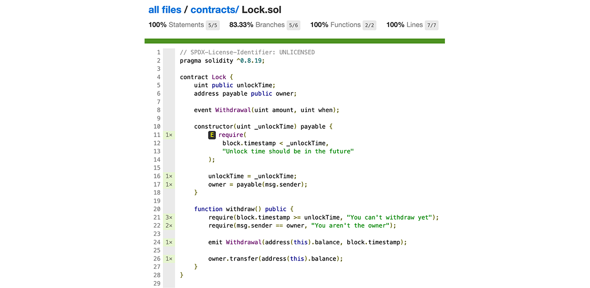

In this tutorial, you'll learn how to profile the test coverage of your smart contracts with [Hardhat] and the [Solidity Coverage] community plugin.

---

## Objectives

By the end of this tutorial, you should be able to:

- Use the Solidity Coverage plugin to analyze the coverage of your test suite
- Increase the coverage of your test suite

---

## Overview

The Solidity Coverage plugin allows you to analyze and visualize the coverage of your smart contracts' test suite. This enables you to see what portions of your smart contract are being tested and what areas may have been overlooked. It's an indispensable plugin for developers seeking to fortify their testing practices and ensure robust smart contract functionality.

## Setting up the Solidity Coverage plugin

The Solidity Coverage plugin is integrated into the Hardhat toolbox package, which is installed by default when you use the `npx hardhat init` command.

To install manually, run `npm install -D solidity-coverage`.

Then, import `solidity-coverage` in `hardhat.config.ts`:

```solidity
import "solidity-coverage"
```

Once the installation completes either manually or via the default Hardhat template, the task `coverage` becomes available via the `npx hardhat coverage` command.

## My first test coverage

Review the following contract and test suite (You'll recognize these if you completed the [Hardhat testing lesson] in our [Base Learn] series).

Contract:

```solidity
// SPDX-License-Identifier: UNLICENSED
pragma solidity ^0.8.19;

contract Lock {
    uint public unlockTime;
    address payable public owner;

    event Withdrawal(uint amount, uint when);

    constructor(uint _unlockTime) payable {
        require(
            block.timestamp < _unlockTime,
            "Unlock time should be in the future"
        );

        unlockTime = _unlockTime;
        owner = payable(msg.sender);
    }

    function withdraw() public {
        require(block.timestamp >= unlockTime, "You can't withdraw yet");
        require(msg.sender == owner, "You aren't the owner");

        emit Withdrawal(address(this).balance, block.timestamp);

        owner.transfer(address(this).balance);
    }
}
```

`Lock.test.ts`:

```solidity
import { expect } from "chai";
import { ethers } from "hardhat";
import { time } from "@nomicfoundation/hardhat-network-helpers";
import { SignerWithAddress } from '@nomicfoundation/hardhat-ethers/signers'
import { Lock__factory, Lock} from '../typechain-types'

describe("Lock Tests", function () {
  const UNLOCK_TIME = 10000;
  const VALUE_LOCKED = ethers.parseEther("0.01");

  let lastBlockTimeStamp: number;
  let lockInstance: Lock;
  let ownerSigner: SignerWithAddress
  let otherUserSigner: SignerWithAddress;

  before(async() => {
    lastBlockTimeStamp = await time.latest()
    const signers = await ethers.getSigners()
    ownerSigner = signers[0]
    otherUserSigner= signers[1]

    const unlockTime = lastBlockTimeStamp + UNLOCK_TIME;

    lockInstance = await new Lock__factory(ownerSigner).deploy(unlockTime, {
      value: VALUE_LOCKED
    })
  })


  it('should get the unlockTime value', async() => {
    const unlockTime = await lockInstance.unlockTime();

    expect(unlockTime).to.equal(lastBlockTimeStamp + UNLOCK_TIME)
  })

  it('should have the right ether balance', async() => {
    const lockInstanceAddress = await lockInstance.getAddress()

    const contractBalance = await ethers.provider.getBalance(lockInstanceAddress)

    expect(contractBalance).to.equal(VALUE_LOCKED)
  })

  it('should have the right owner', async()=> {
    expect(await lockInstance.owner()).to.equal(ownerSigner.address)
  })

  it('should not allow to withdraw before unlock time', async()=> {
    await expect(lockInstance.withdraw()).to.be.revertedWith("You can't withdraw yet")
  })

  it('should not allow to withdraw a non owner', async()=> {
    const newLastBlockTimeStamp = await time.latest()

    await time.setNextBlockTimestamp(newLastBlockTimeStamp + UNLOCK_TIME)

    const newInstanceUsingAnotherSigner = lockInstance.connect(otherUserSigner)

    await expect(newInstanceUsingAnotherSigner.withdraw()).to.be.revertedWith("You aren't the owner")
  })

 it('should allow to withdraw a owner', async()=> {
    const balanceBefore = await ethers.provider.getBalance(await lockInstance.getAddress());

    expect(balanceBefore).to.equal(VALUE_LOCKED)

    const newLastBlockTimeStamp = await time.latest()

    await time.setNextBlockTimestamp(newLastBlockTimeStamp + UNLOCK_TIME)

    await lockInstance.withdraw();

    const balanceAfter = await ethers.provider.getBalance(await lockInstance.getAddress());
    expect(balanceAfter).to.equal(0)
  })
});
```

If you run `npx hardhat coverage`, you should get:

```terminal
 Lock Tests
    ✔ should get the unlockTime value
    ✔ should have the right ether balance
    ✔ should have the right owner
    ✔ shouldn't allow to withdraw before unlock time
    ✔ shouldn't allow to withdraw a non owner
    ✔ should allow to withdraw a owner


  6 passing (195ms)

------------|----------|----------|----------|----------|----------------|
File        |  % Stmts | % Branch |  % Funcs |  % Lines |Uncovered Lines |
------------|----------|----------|----------|----------|----------------|
 contracts/ |      100 |    83.33 |      100 |      100 |                |
  Lock.sol  |      100 |    83.33 |      100 |      100 |                |
------------|----------|----------|----------|----------|----------------|
All files   |      100 |    83.33 |      100 |      100 |                |
------------|----------|----------|----------|----------|----------------|
```

Which then gives you a report of the test coverage of your test suite. Notice there is a new folder called `coverage`, which was generated by the `solidity-coverage` plugin. Inside the `coverage` folder there is a `index.html` file. Open it in a browser, you'll see a report similar to the following:



## Increasing test coverage

Although the coverage of the previous test suite is almost perfect, there is one missing branch when creating the contract. Because you have not tested the condition that the `_unlockTime` has to be greater than the `block.timestamp`:

```solidity
require(
    block.timestamp < _unlockTime,
    "Unlock time should be in the future"
  );
```

In order to increase the coverage, include a new test with the following:

```solidity
  it('should verify the unlock time to be in the future', async () => {
    const newLockInstance = new Lock__factory(ownerSigner).deploy(lastBlockTimeStamp, {
      value: VALUE_LOCKED
    })

    await expect(newLockInstance).to.be.revertedWith("Unlock time should be in the future")
  })
```

Then, run `npx hardhat coverage` and you should get:

```solidity
  Lock Tests
    ✔ should verify the unlock time to be in the future (39ms)
    ✔ should get the unlockTime value
    ✔ should have the right ether balance
    ✔ should have the right owner
    ✔ shouldn't allow to withdraw before unlock time
    ✔ shouldn't allow to withdraw a non owner
    ✔ should allow to withdraw a owner


  7 passing (198ms)

------------|----------|----------|----------|----------|----------------|
File        |  % Stmts | % Branch |  % Funcs |  % Lines |Uncovered Lines |
------------|----------|----------|----------|----------|----------------|
 contracts/ |      100 |      100 |      100 |      100 |                |
  Lock.sol  |      100 |      100 |      100 |      100 |                |
------------|----------|----------|----------|----------|----------------|
All files   |      100 |      100 |      100 |      100 |                |
------------|----------|----------|----------|----------|----------------|
```

## Conclusion

In this tutorial, you've learned how to profile and analyze the test coverage of your smart contracts' test suite. You learned how to visualize the coverage report and improve the coverage of the test suite by using the Solidity Coverage plugin.

---

## See also

[Hardhat]: https://hardhat.org/
[Solidity Coverage]: https://github.com/sc-forks/solidity-coverage
[Hardhat testing lesson]: https://docs.base.org/base-learn/docs/hardhat-testing/hardhat-testing-sbs
[Base Learn]: https://base.org/learn
