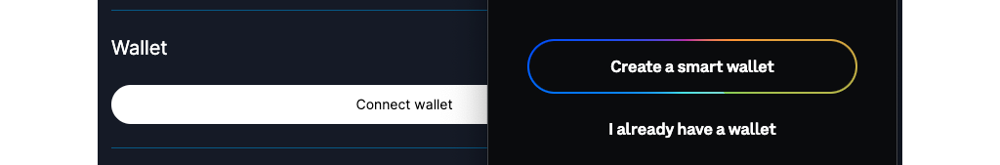

The [Coinbase Smart Wallet] is a great way to onboard new users to onchain apps, and offers a number of experiential improvements to existing crypto users as well. As we're in a period of adoption and transition, a pain point has developed where a user with both the Smart Wallet and a browser-extension EOA can't always select the wallet they want while connecting to an app.

In this tutorial, you'll learn how to more easily improve that experience by using [Wallet] component from [OnchainKit] to connect your users to your app.

---

## Objectives

By the end of this tutorial, you should be able to:

- Create a connection experience using the `Wallet` component from [OnchainKit]
- Customize the `Wallet` component to allow your users to connect from a chosen list of wallets
- Give users the option to select the [Coinbase Smart Wallet] or EOA while connecting to your app with RainbowKit

---

## Prerequisites

### Be familiar with modern, frontend web development

In this tutorial, you'll be working with a React frontend built with [Next.js]. While you don't need to be an expert, we'll assume that you're comfortable with the basics.

### Possess a general understanding of the EVM and smart contract development

This tutorial assumes that you're reasonably comfortable writing basic smart contracts. If you're just getting started, jump over to our [Base Learn] guides and start learning!

### Understand providers and connectors

You'll need to be familiar with how to connect an onchain app to the blockchain with a provider. If you're not, start with the [Onchain App Development] section of [Base Learn], or at least complete the tutorial [Introduction to Providers].

### Coinbase Wallets

You need to have both the [Coinbase Wallet] and [Coinbase Smart Wallet] for this tutorial. You need to set up the [Coinbase Wallet] in advance, but you can create a smart wallet during the tutorial.

---

## The Default Experience

Begin by using [An Onchain App in 100 Components] as a template to quickstart a new app. Click the green `Use this template` button, create a new repo, download it, install dependencies, and run the app.

```bash
bun install
bun run dev
```

The demo app contains sections showing a number of [OnchainKit] components, including the [Wallet]. Click `Connect Wallet` in your browser with the Coinbase wallet active, and you'll get the expected experience for an EOA wallet user with the browser extension.


Next, open the app in a private browser window with extensions disabled, and try again. This time, you'll get the Smart Wallet experience. If you don't have one already, you can create one now. They're neat!



Unfortunately, now that you've realized that the smart wallet is great, you've got a problem. Because you already have a Coinbase EOA wallet via the browser extension, you **can't** connect with your smart wallet **unless** you open a private window.

## Customizing the List of Wallets

Luckily, it isn't too hard to fix this with the [Wallet Aggregator].

### Setting Up the Wallet Aggregator

Open `src/app/page.tsx`. Here, you find the root page for the app. You can see the `<WalletComponents />`, which is what you used to log in and out.

Open `src/components/WalletComponents.tsx`, `src/wagmi.ts`, and `src/components/OnchainProviders.tsx`. Take a quick look at `WalletComponents`. It's a simple implementation that invokes a default experience without customization. You can update this, but first you'll need to make some changes to `OnchainProviders.tsx` and `wagmi.ts`.

Install [RainbowKit] and its dependencies:

```bash
bun add @rainbow-me/rainbowkit wagmi viem@2.x @tanstack/react-query
```

Start with `wagmi.ts`. Update it to use [RainbowKit] connectors:

```tsx
import { http, createConfig } from 'wagmi';
import { baseSepolia } from 'wagmi/chains';
import { metaMaskWallet, rainbowWallet, coinbaseWallet } from '@rainbow-me/rainbowkit/wallets';
import { connectorsForWallets } from '@rainbow-me/rainbowkit';

const connectors = connectorsForWallets(
  [
    {
      groupName: 'Recommended Wallet',
      wallets: [coinbaseWallet],
    },
    {
      groupName: 'Other Wallets',
      wallets: [rainbowWallet, metaMaskWallet],
    },
  ],
  {
    appName: 'onchainkit',
    projectId: '<YOUR WALLET CONNECT ID>',
  },
);

export const wagmiConfig = createConfig({
  chains: [baseSepolia],
  // turn off injected provider discovery
  multiInjectedProviderDiscovery: false,
  connectors,
  ssr: true,
  transports: {
    [baseSepolia.id]: http(),
  },
});

declare module 'wagmi' {
  interface Register {
    config: typeof wagmiConfig;
  }
}
```

Next, open `OnchainProviders.tsx`. Import and add the css for RainbowKit, and the context provider. You'll also need a css file from OnchainKit:

```tsx
'use client';
import { OnchainKitProvider } from '@coinbase/onchainkit';
import { QueryClient, QueryClientProvider } from '@tanstack/react-query';
import type { ReactNode } from 'react';
import { base } from 'viem/chains';
import { WagmiProvider } from 'wagmi';
import { NEXT_PUBLIC_CDP_API_KEY } from '../config';
import { wagmiConfig } from '../wagmi';
import { RainbowKitProvider } from '@rainbow-me/rainbowkit';

import '@coinbase/onchainkit/styles.css';
import '@rainbow-me/rainbowkit/styles.css';

type Props = { children: ReactNode };

const queryClient = new QueryClient();

function OnchainProviders({ children }: Props) {
  return (
    <WagmiProvider config={wagmiConfig}>
      <QueryClientProvider client={queryClient}>
        <OnchainKitProvider apiKey={NEXT_PUBLIC_CDP_API_KEY} chain={base}>
          <RainbowKitProvider modalSize="compact">{children}</RainbowKitProvider>
        </OnchainKitProvider>
      </QueryClientProvider>
    </WagmiProvider>
  );
}

export default OnchainProviders;
```

Finally, in `WalletComponents.tsx`, add `withWalletAggregator` to `<ConnectWallet>`:

```tsx
<Wallet>
  <ConnectWallet withWalletAggregator>
    <Avatar className="h-6 w-6" />
    <Name />
  </ConnectWallet>
  {/* Code continues... */}
</Wallet>
```

You've made changes that sometimes confuse the wallet connection, so clear site data, refresh the page, then try connecting again. Now, you'll get the RainbowKit modal with your list of wallets. You've solved the problem of allowing other types of wallets to connect to your app, but you'll find that the Coinbase wallet works as before - it will default to the EOA if a browser extension is present, but the smart wallet if it is not.

## Tuning the Coinbase Wallet Connection

:::danger

If you've already connected with the site, the below won't work unless you clear site data! It will appear that the flag does nothing.

:::

With RainbowKit, you can force the connector to use the smart wallet or EOA with:

```tsx
coinbaseWallet.preference = 'smartWalletOnly';
```

And:

```tsx
coinbaseWallet.preference = 'eoaOnly';
```

The default is:

```tsx
coinbaseWallet.preference = 'all';
```

This setting exhibits the behavior you've observed before. If the EOA is present, it will be used. Otherwise, the Smart Wallet UI/UX will pop up.

You can use these settings to direct users of your app to your preferred use case, or tie it to a UI element to give them a choice.

:::info

The Coinbase Smart Wallet will support user-selected choice of which wallet to use very soon!

:::

---

## Conclusion

In this tutorial, you've learned how to use [OnchainKit] to create a connection button. You've also learned how to customize the connection experience with [RainbowKit], enabling your users a broader choice of which wallet to use with your app and making sure all are able to enjoy it.

---

[Base Learn]: https://base.org/learn
[Next.js]: https://nextjs.org/
[RainbowKit]: https://rainbowkit.com/
[wagmi]: https://wagmi.sh/
[viem]: https://viem.sh/
[quick start]: https://www.rainbowkit.com/docs/installation
[WalletConnect]: https://cloud.walletconnect.com/
[smart contract development]: https://base.org/learn
[Base]: https://docs.base.org/network-information
[smart contract development]: https://base.org/camp
[`createConfig`]: https://wagmi.sh/react/api/createConfig
[Introduction to Providers]: /intro-to-providers
[Onchain App Development]: https://docs.base.org/base-learn/docs/frontend-setup/overview
[Coinbase Wallet]: https://www.coinbase.com/wallet
[Coinbase Smart Wallet]: https://www.coinbase.com/wallet/smart-wallet
[custom wallet list]: https://www.rainbowkit.com/docs/custom-wallet-list
[OnchainKit]: https://onchainkit.xyz/?utm_source=basedocs&utm_medium=tutorials&campaign=smart-wallet-and-eoa-with-onchainkit
[Wallet]: https://onchainkit.xyz/wallet/wallet
[An Onchain App in 100 Components]: https://github.com/Zizzamia/an-onchain-app-in-100-components
[Wallet Aggregator]: https://onchainkit.xyz/wallet/wallet#use-wallet-aggregator
