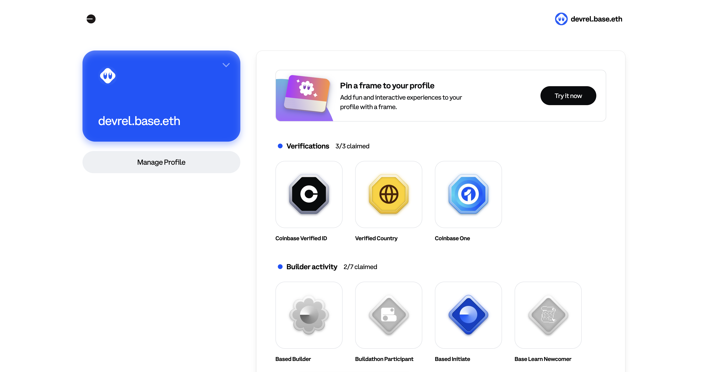
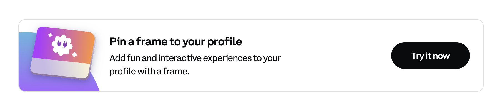
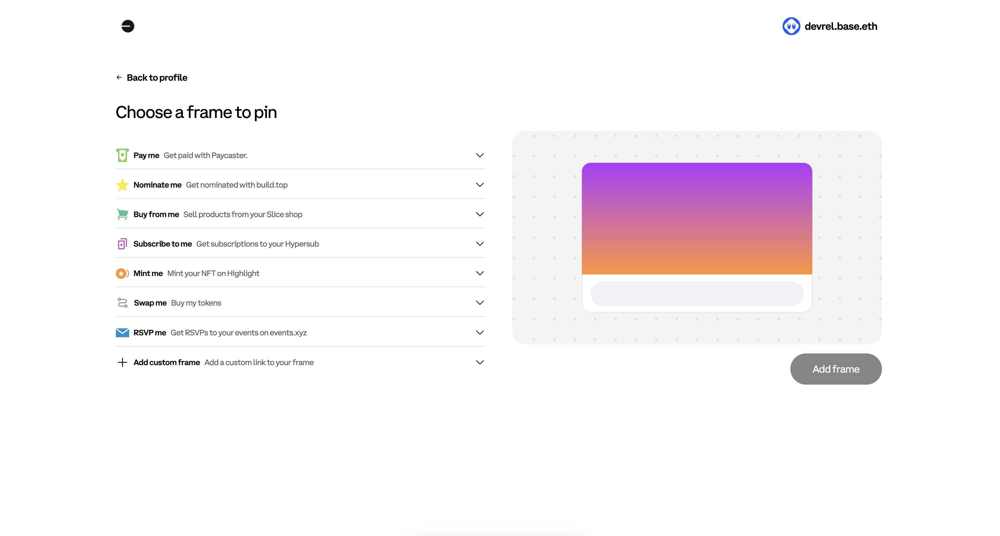
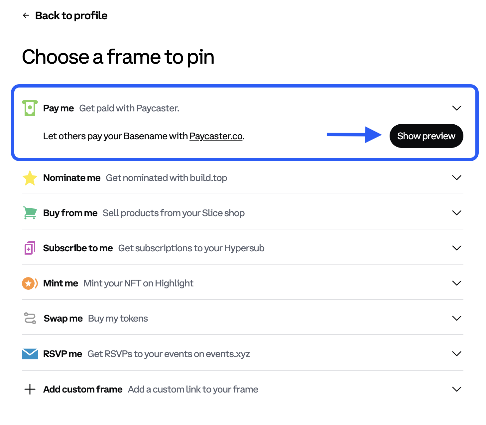
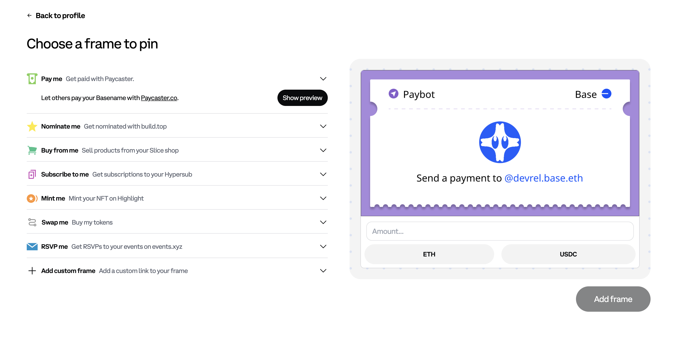
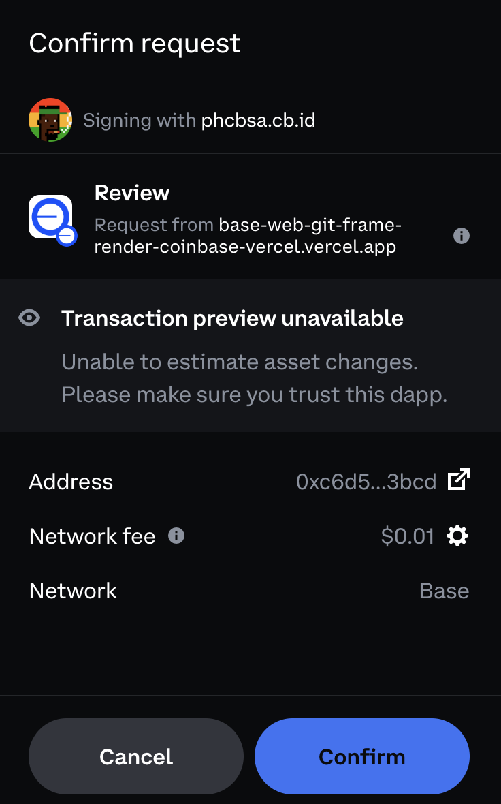
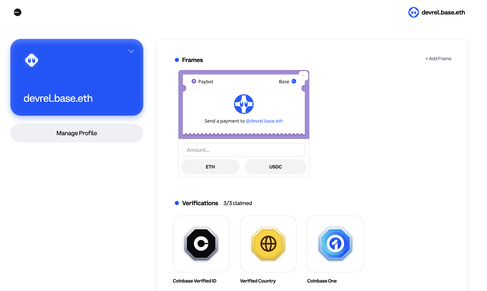

# Add Frames to A Basename

Welcome to the exciting world of Frames for your Basename! This tutorial will guide you step-by-step through adding a frame to your Basename, allowing you to personalize and display unique content on the Base.

## What Are Frames?

Frames are dynamic visual elements that display custom content on your Basename using any [Open Graph spec] extensions. You may be familiar with frames from platforms like [Warpcast], where they are used to enhance social interactions like minting NFTs onchain, sharing information, and more. Open Frames work similarly, but they are independent of Warpcast and are the best way for adding frames to your Basename. With Open Frames, anyone can create and display content directly on their Basename.

## Prerequisites

Before you begin, ensure you have the following:

- A registered Basename. If you do not have one, [claim a basename](https://www.base.org/names) now.
- A small amount of ETH to submit the text record onchain

## Navigate to Your Basename

To get started, head over to a Basename that you own. For example:

`https://www.base.org/name/devrel`

## Look for the Frame Banner

Once you're on your profile, you’ll be greeted with a new banner inviting you to pin a frame to your profile. Look for the call-to-action button and click `Try it now`.

## Explore the Frame Selection Panels

You'll now see two panels to help you choose and preview frames for your profile. The left panel contains pre-built frames created by the Base community, while the right panel allows you to preview how the selected frame will look on your Basenames profile.

## Choose a Frame

You can select any frame from the available options. For this tutorial, we’ll use the pre-built "Pay Me" Frame by [Paycaster](https://paycaster.co/), which allows anyone to gift you USDC or ETH.

Click on the dropdown menu to select the "Pay Me" Frame.

## Preview the Frame

Once you've selected the frame, click on the `Show preview` button to see how it will appear on your profile.

## Add the Frame to Your Profile

If you're happy with the preview, it's time to add the frame to your profile! Click the `Add frame` button.

You'll be prompted to confirm the transaction in your wallet. Approve the transaction, and the page will automatically reload.

## View Your Updated Profile

After the page reloads, you’ll see your profile with the newly added frame. Congratulations! You’ve successfully added a frame to your Basenames profile.

Feel free to customize your Frames further or explore new designs from the community!

## Resources

For more information on Frames and how to customize them, check out the following resources:

- [Open Frames Spec](https://www.openframes.xyz/#required-properties)
- [Frames Debugger](https://debugger.framesjs.org/)
- [Openframes Website](https://www.openframes.xyz/)
- [Open Graph spec](https://ogp.me/)
- [Warpcast](https://warpcast.com/)

---

[Open Frames Spec]: https://www.openframes.xyz/#required-properties
[Open Frames]: https://www.openframes.xyz/
[Frames Debugger]: https://debugger.framesjs.org/
[Openframes Website]: https://www.openframes.xyz/
[Open Graph spec]: https://ogp.me/
[Warpcast]: https://warpcast.com/
