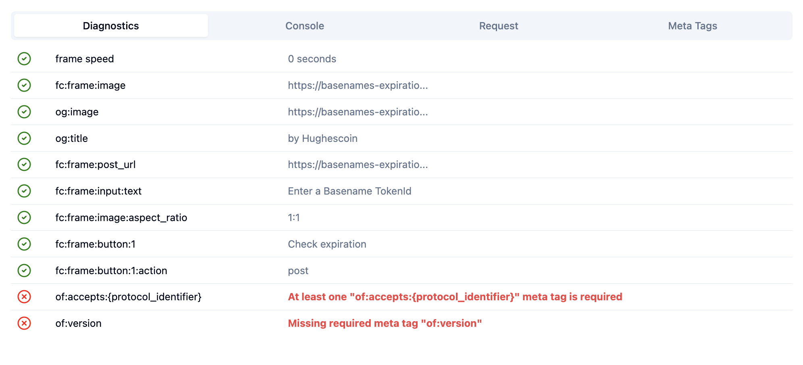
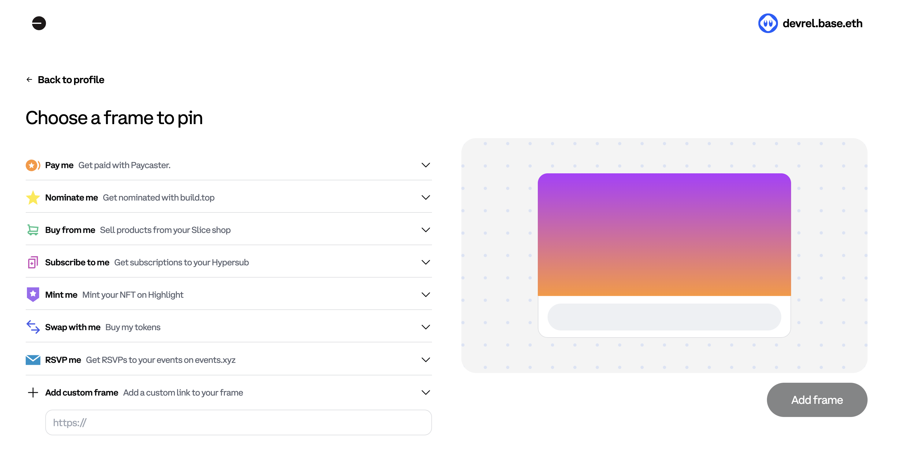

# Convert Farcaster Frame to Open Frame using OnchainKit

In this tutorial, we'll guide you through the process of converting a [Farcaster Frame] to an [Open Frame] using [OnchainKit]. This conversion will allow your frame to be more versatile and compatible with various platforms beyond Farcaster.

## Prerequisites

Before starting this tutorial, ensure you have:

- An existing Farcaster Frame
- A frame server (we'll use Vercel in this example)
- Basic knowledge of Next.js and its [App Router]

To convert your Farcaster Frame to an Open Frame, we need to make several changes:

1. Update the frame metadata
2. Modify the API endpoint (Frame server)
3. Adjust button configurations
4. Remove Farcaster-specific validations

:::tip Your Frame can support Farcaster and Open Frames

If you want to have support for Open Frames and Farcaster Frames, create a new route that is specific to the protocol you want.

For example `src/app/frame-fc` is the route for farcaster frames and `src/app/frame-of` will render frames using the open frame spec.
:::

Let's go through each of these changes step by step.

## Update the Frame Metadata

First, you need to update the frame metadata to indicate that it's an Open Frame. We'll use the `isOpenFrame` property from OnchainKit to specify the Open Frame protocol.

Then, you will need to add a [client protocol identifier] which will be `anonymous`.

### Before:

```javascript
const frameMetadata = getFrameMetadata({
  buttons: [
    {
      label: 'Check expiration',
      action: 'post',
    },
  ],
  image: {
    src: `${NEXT_PUBLIC_URL}/basename-starter-image.png`,
    aspectRatio: '1:1',
  },
  input: {
    text: 'Enter a Basename TokenId',
  },
});
```

### After:

```javascript
const frameMetadata = getFrameMetadata({
  isOpenFrame: true,
  accepts: { anonymous: '1' },
  buttons: [
    {
      label: 'Check expiration',
      action: 'post',
      target: `${NEXT_PUBLIC_URL}/api/openframe`,
    },
  ],
  image: {
    src: `${NEXT_PUBLIC_URL}/basename-starter-image.png`,
    aspectRatio: '1:1',
  },
  input: {
    text: 'Enter a Basename TokenId',
  },
});
```

In the updated metadata, we've added two important properties:

1. `isOpenFrame: true`: This indicates that our frame is now compatible with the Open Frame specification.

2. `accepts: { anonymous: '1' }`: This is a required meta property for Open Frames. It specifies that our frame accepts anonymous interactions, meaning it doesn't require authentication.

By including this property, we're essentially saying that our frame can be interacted with anonymously, making it more accessible and compatible with a wider range of clients and platforms beyond just Farcaster.

## Modifying the Frame Server

Next, you need to update our Frame Server to handle Open Frame requests. This involves removing Farcaster-specific validations and adjusting how we process the incoming data.

Frame servers are located in the `src/app/api/` route of a Next.js project.

### Before:

```javascript
const body: FrameRequest = await req.json();
const { isValid, message } = await getFrameMessage(body, {
  neynarApiKey: 'NEYNAR_ONCHAIN_KIT',
});

if (!isValid) {
  return new NextResponse('Message not valid', { status: 500 });
}

// Process the request...
```

### After:

```javascript
const body = await req.json();

// Process the request using body.untrustedData instead of message
// Remove Farcaster-specific validations

console.log('body', body);

let text = body.untrustedData.inputText;

if (!text) {
  return new NextResponse('No text', { status: 500 });
}

// Process the request...
```

:::note

When converting from a Farcaster Frame to an Open Frame, the message validation process changes significantly. Farcaster Frames use [signed messages] to ensure authenticity, while Open Frames don't require this validation. You should be aware of this trade-off and implement additional security measures if needed.

:::

## Adjust the Button Configurations

For Open Frames, we need to use the `target` property for button actions instead of `postUrl`.

### Before:

```javascript
buttons: [
  {
    label: 'Check expiration',
    action: 'post',
  },
],

// additional code
postUrl: <your-post-url>
```

### After:

```javascript
buttons: [
  {
    label: 'Check expiration',
    action: 'post',
    target: `${NEXT_PUBLIC_URL}/api/openframe`,
  },
],
```

## Removing Farcaster-specific Validations and Dependencies

To convert your Farcaster Frame to an Open Frame, you need to remove Farcaster-specific validations and dependencies. This includes removing the `getFrameMessage` function and its related imports and usage. As well as any checks for FIDs (Farcaster IDs) or other Farcaster-only data.

### Before:

```javascript
import { FrameRequest, getFrameMessage, getFrameHtmlResponse } from '@coinbase/onchainkit/frame';

const { isValid, message } = await getFrameMessage(body, {
  neynarApiKey: 'NEYNAR_ONCHAIN_KIT',
});

if (!isValid || !message?.fid) {
  return new NextResponse('Invalid request', { status: 400 });
}

return new NextResponse(
  getFrameHtmlResponse({
    //additional code
    image: {
      // image data
    },
    input: {
      text: 'Enter a Basename TokenId',
    },
    postUrl: `${NEXT_PUBLIC_URL}/api/openframe`,
  }),
);
```

### After:

```javascript
// Remove Farcaster-specific validations
// Process the request using body.untrustedData

import { FrameRequest, getFrameHtmlResponse } from '@coinbase/onchainkit/frame';
import { NextRequest, NextResponse } from 'next/server';
import { NEXT_PUBLIC_URL } from '../../../config';
import { generateWarpcastURL } from 'src/utils';

async function getResponse(req: NextRequest): Promise<NextResponse> {
  const body: FrameRequest = await req.json();
  console.log('body', body);

  const text = body.untrustedData.inputText;

  if (!text) {
    return new NextResponse('No text', { status: 500 });
  }

  const state = {
    page: 0,
  };

  return new NextResponse(
    getFrameHtmlResponse({
      isOpenFrame: true,
      accepts: { anonymous: '1' },
      buttons: [
        {
          label: 'Check another name',
          action: 'post',
          target: `${NEXT_PUBLIC_URL}/api/openframe`,
        },
        {
          label: `Share`,
          action: 'link',
          target: generateWarpcastURL(
            'When does your Basename expire?',
            `${NEXT_PUBLIC_URL}/expiration-frame-open`,
          ),
        },
      ],
      image: {
        src: `${NEXT_PUBLIC_URL}/api/og?tokenId=${text}`,
        aspectRatio: '1:1',
      },
      input: {
        text: 'Enter a Basename TokenId',
      },
      postUrl: `${NEXT_PUBLIC_URL}/api/openframe`,
      state: {
        page: state?.page + 1,
        time: new Date().toISOString(),
      },
    }),
  );
}

export async function POST(req: NextRequest): Promise<Response> {
  return getResponse(req);
}

export const dynamic = 'force-dynamic';
```

Repeat this process for any of the additional routes you may want to convert from Farcaster Frames to Open Frames.

## Redploy your frame

Before redeploying your Frame check how the routes differ using the [Frame Debugger]. The frame debugger should be used to validate that your frame follows the Openframe protocol spec.

:::tip use `Anonymous`
Frame Dugger allows you to select the protocol you wish to debug.
For Open Frame, use the `anonymous (openframes)` option



:::

### Before:


### After:

Your converted Farcaster Frame should pass all checks like the below image:


Your frame should still have functionality w/o the farcaster dependency. Use the [Farcaster Frame Validator] to confirm.

## Conclusion

By following these steps, you've successfully converted your Farcaster Frame to an Open Frame using Onchain Kit. Your frame is now more versatile and can be used across various platforms that support Open Frames.

Remember to test your converted frame thoroughly to ensure it works as expected in different environments. Happy framing!

## Resources

- [Open Frames Specification](https://www.openframes.xyz/)
- [Onchain Kit Documentation](https://onchainkit.xyz/)
- [Farcaster Documentation](https://docs.farcaster.xyz/)
- [Frame Debugger](https://debugger.framesjs.org/)

---

[App Router]: https://nextjs.org/docs/app
[Farcaster Frame]: https://docs.farcaster.xyz/developers/frames/spec
[Open Frame]: https://www.openframes.xyz/
[OnchainKit]: https://onchainkit.xyz/
[client protocol identifier]: https://www.openframes.xyz/#the-client-protocol-identifier
[signed messages]: https://docs.farcaster.xyz/developers/frames/spec#frame-signature
[Farcaster Frame Validator]: https://warpcast.com/~/developers/frames
[Frame Debugger]: https://debugger.framesjs.org/
