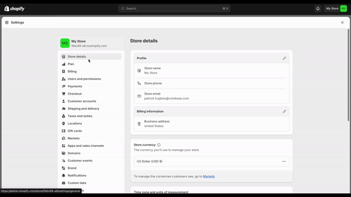

Deploy a Shopify Storefront with [Coinbase Commerce Plugin](https://docs.cdp.coinbase.com/commerce-onchain/docs/integrate-shopify/)
[Shopify](https://www.shopify.com/) provides a robust platform for creating online stores.

[Shopify Storefronts](https://www.shopify.com/custom-storefront-tools) allow you to create unique experiences for your online store.

This tutorial will guide you through setting up a Shopify storefront that integrates with Coinbase Commerce, allowing you to accept cryptocurrency payments.

Learn more about [Hydrogen and Oxygen](https://shopify.dev/docs/storefronts/headless/hydrogen/fundamentals).

## Objectives

By the end of this tutorial should be able to:

- Create a Shopify storefront
- Link your Coinbase Commerce account to Shopify
- Link Shopify credentials to your storefront
- Deploy a test site using Hydrogen/Oxygen

## Prerequisites

### Coinbase Commerce

You will need a Coinbase Commerce Managed account to proceed. You can sign up for a business account [here](https://beta.commerce.coinbase.com/sign-up).

### Shopify

You will need a Shopify [Basic plan](https://www.shopify.com/pricing) for this demo, creating a custom storefront, and using Hydrogen/Oxygen

#### Hydrogen

Hydrogen is Shopify's React-based framework for developing custom storefronts, offering components, utilities, and design patterns to simplify working with Shopify APIs. These projects are Remix apps preconfigured with Shopify-specific features.

#### Oxygen

Oxygen is Shopify’s global serverless hosting platform for deploying Hydrogen storefronts at the edge, managing deployment environments, environment variables, caching, and integrating with Shopify’s CDN.

## Getting Started

To comply with Shopify's requirements, the Coinbase Commerce account linked to Shopify must be a Coinbase Managed account.

To create one, [sign up](https://beta.commerce.coinbase.com/sign_up) for a business account and select "Coinbase Commerce" as the account type. See this Coinbase Commerce Merchant [help article](https://help.coinbase.com/en/commerce/getting-started/merchant-guidelines-commerce-application) for additional information on how to sign your business up.

### Link Coinbase Commerce to your Shopify store



Once, you've created a Coinbase Commerce Managed account you can now add the plugin to your Shopify store.

To add Coinbase Commerce as a payment method on your Shopify store, start by navigating to your admin page at `https://admin.shopify.com/store/<YOUR-STORE-NAME>`. Once there, click on Settings , located in the bottom left panel of the screen (or at `https://admin.shopify.com/store/<YOUR-STORE-NAME>settings/general`). Then select the “Payments” tab. Proceed by clicking “Add a payment method” and choose “Search by provider.” In the search field, type in “Coinbase” and select “Coinbase Commerce” from the results.
Click "Install" and you should be redirected to Coinbase Commerce with aprompt log into your Coinbase account. Finally, click "Activate" to enable the Coinbase Commerce plugin.

### Create a Storefront

In this tutorial, we'll guide you through the steps to create a new Hydrogen storefront for your Shopify store. This will allow you to showcase the products you already have in your Shopify account. Make sure you've already created your products by following the [Shopify products guide](https://help.shopify.com/en/manual/online-sales-channels/shop/products-and-collections).

To get started, we'll first clone a Shopify demo store using the Hydrogen framework. This will give us a quick setup to work with.

```bash
npm create @shopify/hydrogen@latest -- --quickstart
```

Once the demo store is cloned, navigate into the project directory and start the development server:

```bash
cd hydrogen-quickstart
npx shopify hydrogen dev
```

Next, you'll need to link your Hydrogen project to your Shopify store. This step connects the demo storefront with your Shopify account, allowing you to display your products.

```bash
npx shopify hydrogen link
```

To ensure your storefront is properly configured, update the project environment variables. This pulls the necessary settings from your Shopify account into the Hydrogen project.

```bash
npx shopify hydrogen env pull
```

Now, let's verify that everything is set up correctly and your site is running. Start the development server again:

```bash
npx shopify hydrogen dev
```

Finally, deploy your Hydrogen storefront to Oxygen, Shopify's hosting platform for Hydrogen apps. Run the following script:

```bash
npx shopify hydrogen deploy
```

Select **Preview** as the deployment type. After deployment, your terminal should display a URL where you can view your live site, such as:

Your terminal should display a url like:
`https://hydrogen-quickstart-20c3648d482c7a17d77d.o2.myshopify.dev/`

And that's it! You've successfully created and deployed your Hydrogen storefront.

## Conclusion

You now have a custom store front with the products from your Shopify account.
