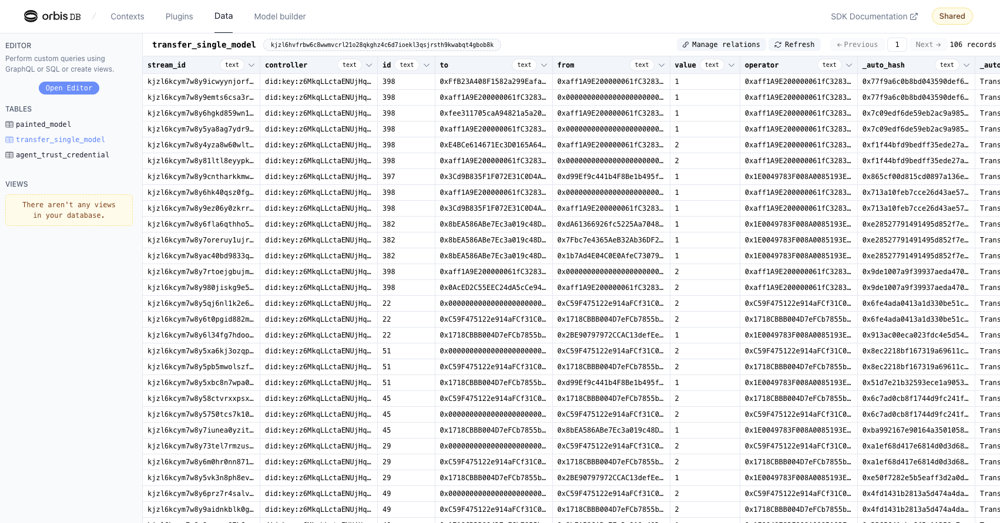
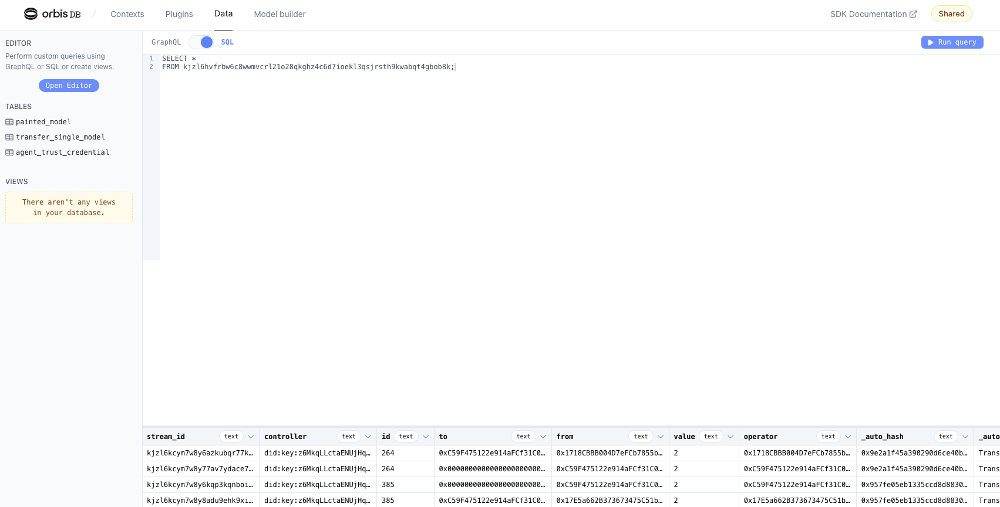

Deploy a blockchain event listener with [OrbisDB](https://useorbis.com/), a decentralized relational database built on the [Ceramic Network](https://ceramic.network/).

This tutorial will guide you through what Ceramic is, how OrbisDB provides a relational database interface to Ceramic's verifiable data streams, and how Base developers can leverage an OrbisDB plugin to listen and index blockchain events for any smart contract.

## Objectives

By the end of this tutorial you will be able to:

- Use the OrbisDB UI to set plugins and view data
- Use OrbisDB to index smart contract events from a Base contract
- Query OrbisDB data from both the UI and SDK

## Overview

Developers building on Base (and other blockchains) are frequently tasked with building trustless, resilient, decentralized systems that service customer needs beyond what's available exclusively on-chain. For some applications, representing highly dynamic data (like identity), or high volumes of sensor data from DePin networks would be too costly and inefficient to write on-chain. Other developers need to traverse, aggregate, and query on-chain data using patterns that aren't possible with standard Web3 libraries. As such, decentralized data availability providers are purpose-built for use cases like these, in addition to any project that requires higher performance, faster processing, and more cost-effective solutions for decentralized data at scale. One of those providers is [Ceramic](https://ceramic.network/).

Ceramic is a decentralized data network that combines high data provenance and verifiability most often associated with blockchain networks with the cost efficiencies, scalability, and flexible querying capabilities usually associated with traditional database systems.

### How does Ceramic work?

The Ceramic Protocol operates on decentralized event streams, where user accounts—powered by decentralized identifiers (DIDs) cryptographically sign data events and submit them to the network. These events are synchronized across subscribing nodes in the network and arranged into event logs, or Ceramic "streams." Each stream offers the flexibility to hold various types of content, making Ceramic suitable for a wide range of data applications, including user profiles, posts, relationships, and more, while retaining the history of changes that stream has endured over its lifetime.

To further extend Ceramic's functionality, most developers will utilize a database interface that sits on top of the Ceramic protocol, which opens flexible optionality around preferred database types, hosting methods, and other developer tooling.

### OrbisDB

As the objectives suggest, this guide will show you how to use OrbisDB, an open-source relational database that inherits data ownership, composability, and the decentralized properties of the network it’s built on (Ceramic). OrbisDB provides many developer-friendly experiences in a highly scalable way such as multiple ways to query data, a built-in dashboard UI, shared nodes for testing and iteration, and an ecosystem of plugins that extends its data functionality.

This guide will show developers how to use the on-chain event listener plugin to index events from a Base smart contract.

## Getting Started

Developers can choose from multiple options when using OrbisDB:

1. Using the hosted [OrbisDB Studio](https://studio.useorbis.com/) and the default shared endpoints (for testing and quick iteration - not for production)
2. A [local instance](https://orbisclub.notion.site/Local-d3e9dd97e97b4c00a530b6ada20a8536)
3. A [self-hosted](https://orbisclub.notion.site/Self-hosted-603eb88f811f4bd596c2af38d187ac81) (running in the cloud is ideal for production)

These configuration options give developers as much or as little control over how their nodes are operated as they feel comfortable with. As such, for ease of use and to get started quickly, this guide will use the hosted [OrbisDB Studio](https://studio.useorbis.com/) version.

### Enter the OrbisDB Studio

Visit the [OrbisDB Studio](https://studio.useorbis.com/) in your browser to get started. If it is your first time to the shared studio, you will likely see the following screen:


You will be prompted to connect with your wallet and configure a new shared instance (free for developers). You should also see a signature message appear in your browser that looks similar to the following:


Signing this message will create an authenticated browser-side session that will be used on your behalf to write verified data to Ceramic using OrbisDB. As you'll see later when we explore the studio, developers can create new data models, implement plugins, and perform other write actions through the studio view. This browser session allows the front end to do so.

### Exploring the Studio view

The OrbisDB studio interface is split into 4 parts:

**Contexts**

This is where you can define new application contexts, as well as a view into your Ceramic node URL, OrbisDB instance endpoint, and environment ID (all of which are needed when using the SDK):


**Plugins**

A section where you can configure various plugins to extend your data's functionality. You can also build your own if running a local or self-hosted OrbisDB instance:


**Data**

This is where our data will appear once records are made using our node endpoints and environment ID. You can also query your data using this view (which will be explored later in this guide):


**Model Builder**

Finally, the model builder allows developers to design and deploy new schemas to their OrbisDB instance:


### Create a New Context

Contexts allow developers to organize their data across different applications or projects. Developers can create sub-contexts within each context for a more detailed and granular approach.

Create a new context in the "Contexts" tab by clicking "Add context". You can name this context whatever you prefer.

### Configure the Base Event Listener Plugin

Now that you've established a new context you can set up your plugin. Navigate to the "Plugins" tab in the studio view and click on the "Base Event Listener" plugin. Once on the plugin page, you'll notice instructions conveniently listed for you:


Click "Install plugin" on the right-hand side to apply the plugin to your OrbisDB instance.

Next, assign your plugin to the context you just created:


You will be prompted to add additional information on the following screen:

1. WebSocket RPC URL - you can obtain one for free by creating a new project in your [Alchemy](https://dashboard.alchemy.com/) dashboard. Make sure you copy the endpoint for Base (starting with `wss://`).
2. Contract address - select any active contract you wish to observe. For example, you can use the [BasePaint](https://basescan.org/token/0xba5e05cb26b78eda3a2f8e3b3814726305dcac83) token contract (`0xBa5e05cb26b78eDa3A2f8e3b3814726305dcAc83`).
3. Contract ABI - this must be the contract's ABI for the same contract address you entered in step 2 above. You can use Basescan for many verified contracts by going to the [Contract tab](https://basescan.org/token/0xba5e05cb26b78eda3a2f8e3b3814726305dcac83#code) and copying the matching value for "Contract ABI".
4. Contract Event Name - finally, select the smart contract event from that contract you want to track.


Once ready, go ahead and click the "Save" button to save your plugin's configuration.

## Viewing and Querying Data

The event listener plugin will not retroactively index events, so depending on the frequency with which the event you chose is emitted within the contract, your corresponding OrbisDB table may already start intaking records. Navigate back to the "Data" tab in your studio view. Over time, as events are triggered and indexed, your view might look something like this:



At the top of your table's view, you'll see a string that begins with "k" next to the name of your table (which is semantically associated with the event you're listening for). This string is the static identifier for the table in Ceramic Stream ID format. You'll use this in most cases in queries and application code when performing reads against this table's values. Go ahead and copy this value to your clipboard.

As mentioned above, developers can also query their data from within the OrbisDB UI. Click the "Open Editor" button on the upper left-hand side from within the "Data" tab. You can toggle between GraphQL or SQL to test queries:



### Using the SDK

In most cases, developers will need to query data from within their application logic. Using our Basepaint example above, this may look something like:

```TypeScript
import { OrbisDB } from "@useorbis/db-sdk";

// bring in the identifier for our table (or import from a private env file)
const SINGLE_TRANSFER_TABLE = "kjzl6hvfrbw6c8wwmvcrl21o28qkghz4c6d7ioekl3qsjrsth9kwabqt4gbob8k";

// instantiate an OrbisDB client
const orbis = new OrbisDB({
      ceramic: {
        // this is the gateway from your "Contexts" tab in your studio
        gateway: "https://ceramic-orbisdb-mainnet-direct.hirenodes.io/",
      },
      nodes: [
        {
          // both of the below are also from your studio view
          gateway: "https://studio.useorbis.com",
          env: "<your-env-ID>"
        },
      ],
  });

// below is an example of running raw SQL
const recordsQueryRaw = await orbis
  .select()
  .raw(`SELECT * FROM ${SINGLE_TRANSFER_TABLE} as table WHERE table.value = 2`)
  .context(CONTEXT_ID);
  .run();

// using the built-in ORM
const recordsQuery = await orbis
  .select("to", "from", "value", "operator")
  .from(SINGLE_TRANSFER_TABLE)
  .where({ to: "some-address" })
  .context(CONTEXT_ID);
  .run();

// using GraphQL - you can find your endpoint in your studio view
const postQuery = await fetch(GRAPHQL_ENDPOINT, {
    method: "POST",
    headers: {
      "Content-Type": "application/json",
    },
    body: JSON.stringify({
            query: `
              query {
                transfer_single_model {
                  value
                  to
                  from
                }
              }
            `,
          }),
    });

```

## Conclusion

You now know how to configure a blockchain event listener to monitor, index, and query events on Base!

For more information on how to start extending your decentralized data with Ceramic, visit:

- [Ceramic Documentation](https://developers.ceramic.network/)
- [Ceramic Blog](https://blog.ceramic.network/)
- [OrbisDB Website](https://useorbis.com/)
- [Get in touch](https://ceramic.network/contact-us) with the Ceramic team
